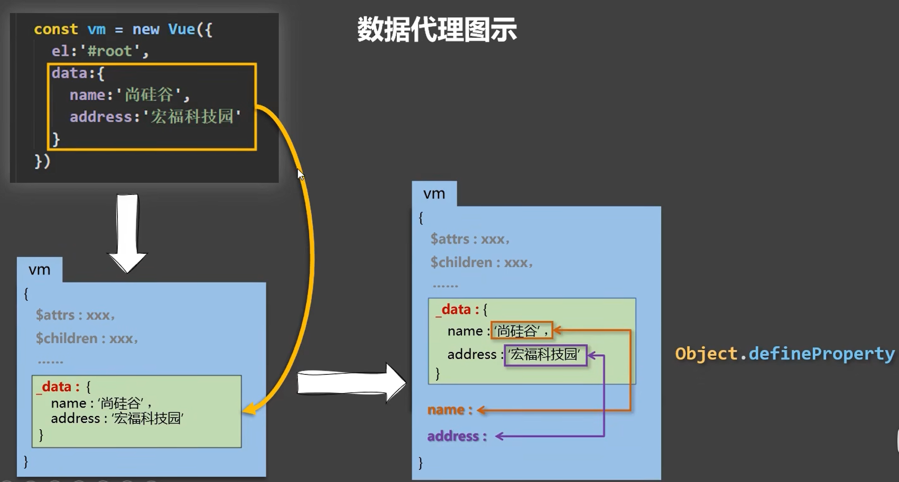

# Vue 2+3

# 01、初识vue

1. 想让Vue工作，就必须创建一个Vue实例，且传入一个配置对象；

2. root容器里的代码依然符合HTML规范，只不过混入了一些特殊的vue语法；

3. root容器里的代码被称为**vue模板**

4. 实例和容器之间是一对一的关系

5. 插值表达式  **{{   }}**  里面写的是js表达式

   

   注意区分： js表达式和js代码（语句）

      1. 表达式：一个表达式会产生一个值，可以放在任何一个需要值的地方：

         1.1 a

         1.2 a+b

         1.3 demo(1)

         1.4 x === y ? 'a': 'b'

      2. js代码（语句）

   ​       2.1 if(){}

   ​	2.2 for(){}

    

   ```html
   <!DOCTYPE html>
   <html lang="en">
   <head>
       <meta charset="UTF-8">
       <meta name="viewport" content="width=device-width, initial-scale=1.0">
       <title>初识vue</title>
       <!-- 引入vue -->
       <script type="text/javascript" src="../js/vue.js"></script>
   </head>
   <body>  
       <!-- 准备好一个容器 -->
        <div id="root">
           <h1>Hello {{name}}</h1>
        </div>
   
        <script type="text/javascript">
           Vue.config.productionTip = false  //阻止vue在启动时生成生产提示
   
           // 创建vue实例
           const x = new Vue({
               el: '#root',  //el用于指定当前Vue实例为哪个容器服务，值通常为css选择器字符串，这里的#root，选择的就是上面id="root"的那个容器
               // data中用于存储数据，数据供el所指定的容器去使用，值我们先暂时写成一个对象。
               data: {
                   name: 'world1'
               }
           })
        </script>
   </body>
   </html>
   ```


# 02、Vue模板语法


Vue模板语法有两大类：

1. 插值语法：

​		功能：用于解析标签体的内容

​		写法： {{xxx}}，xxx是js表达式，并且可以直接读取到data中的所有属性。

2. 指令语法：

   ​	功能：用于解析标签（包括：标签属性，标签体内容，绑定事件......）。

   ​	举例：v-bind:href="xxx"  或  简写为     :href="xxx"    ，xxx同样要写js表达式，并且可以直接读取到data中的所有属性。

3. 备注：Vue中有很多的指令，且形式都是  v-???   ，此处只是使用v-bind举个例子。


```HTML
<!DOCTYPE html>
<html lang="en">

<head>
    <meta charset="UTF-8">
    <meta name="viewport" content="width=device-width, initial-scale=1.0">
    <title>模板语法</title>
    <script type="text/javascript" src="../js/vue.js"></script>
</head>

<body>
    <!-- 准备好一个容器 -->
    <div id="root">
        <h1>插值语法</h1>
        <h3>你好，{{name}}</h3>
        <hr>
        <h1>指令语法</h1>
        <a v-bind:href="url">百度</a>
        <a :href="url2">哔哩哔哩</a>

    </div>

</body>
<script type="text/javascript">
    new Vue({
        el: '#root',
        data: {
            name: 'jack',
            url: 'https://www.baidu.com',
            url2: 'https://www.bilibili.com'
        }
    })
</script>

</html>
```


# 03、数据绑定


Vue中有2种数据绑定的方法：

1. 单向绑定(v-bind)：数据只能从data流向页面。

2. 双向绑定(v-model)：数据不仅能从data流向页面，还可以从页面流向data。

3. 备注：

   ​         双向绑定一般都应用在表单类元素上（如：input，select，等）。

​		v-model:value   可以简写为   v-model   ，因为v-model默认收集的就是value值。


```html
<!DOCTYPE html>
<html lang="en">

<head>
    <meta charset="UTF-8">
    <meta name="viewport" content="width=device-width, initial-scale=1.0">
    <title>数据绑定</title>
    <script type="text/javascript" src="../js/vue.js"></script>
</head>

<body>
    <!-- 准备好一个容器 -->
    <div id="root">
        <!-- 普通写法 -->
        <!-- 单向数据绑定：<input type="text" v-bind:value="name"><br>
        双向数据绑定：<input type="text" v-model:value="name"><br> -->

        <!-- 简写 -->
        单向数据绑定：<input type="text" :value="name"><br>
        双向数据绑定：<input type="text" v-model="name"><br>


        <!-- 如下代码是错误的，因为v-model只能应用在表单类元素（输入类元素）上 -->
        <!-- <h2 v-model:x="name">nihao</h2> -->
    </div>

</body>
<script type="text/javascript">
    new Vue({
        el: '#root',
        data: {
            name:'jie',
        }
    })
</script>

</html>
```


# 04、el与data的两种写法

1. el的两种写法

   （1） new Vue的时候配置el属性。

   （2） 先创建Vue实例，随后再通过vm.$mount('#root')指定el的值。

2. data的两种写法

​       （1） 对象式

​       （2） 函数式

​	 如何选择：目前哪种写法都可以，以后学习到组件时，data必须使用函数式，否则会报错。

3. 一个重要的原则：

   	由Vue管理的函数，一定不要写箭头函数，一旦写了箭头函数，this就不再是Vue实例了。

```html
<!DOCTYPE html>
<html lang="en">

<head>
    <meta charset="UTF-8">
    <meta name="viewport" content="width=device-width, initial-scale=1.0">
    <title></title>
    <script type="text/javascript" src="../js/vue.js"></script>
</head>

<body>
    <!-- 准备好一个容器 -->
    <div id="root">
        <h1>你好，{{name}}</h1>
    </div>

</body>
<script type="text/javascript">
    // el的两种写法
    // const v = new Vue({
    //     // el: '#root',  第一种写法
    //     data: {
    //         name: 'jie1',
    //     }
    // })
    // console.log(v);
    // v.$mount('#root')   // 第二种写法

    // data的两种写法
    new Vue({
        el: '#root',
        // data的第一种写法：对象式
        // data: {
        //     name:'jie'
        // }

        // data的第二种写法：函数式
        data(){
            console.log('--->',this);  // 此处的this是Vue实例对象，并且不能用箭头函数，因为箭头函数没有自己的this，会向上找，就会找到window
             
            return {
                name: 'Jie'
            }
        }
    })

</script>

</html>
```


# 05、理解MVVM模型

1. M：模型（Model）：data中的数据
2. V：视图（View）：模板代码
3. VM：视图模型（ViewModel）：Vue实例

观察发现：

1. data中所有的属性，最后都出现在了vm身上。
2. vm身上所有的属性，以及Vue原型上所有的属性，在Vue模板中都可以直接使用。

```html
<!DOCTYPE html>
<html lang="en">
<head>
    <meta charset="UTF-8">
    <meta name="viewport" content="width=device-width, initial-scale=1.0">
    <title>理解MVVM</title>
    <!-- 引入vue -->
    <script type="text/javascript" src="../js/vue.js"></script>
</head>
<body>  
    <!-- 准备好一个容器 -->
     <div id="root">
        <h1>学校名称 {{name}}</h1>
        <h1>学校地址 {{address}}</h1>
        <!-- <h1>test1: {{1+1}}</h1>
        <h1>test2: {{$options}}</h1>
        <h1>test3: {{$emit}}</h1>
        <h1>test4: {{_c}}</h1> -->
     </div>

     <script type="text/javascript">
        Vue.config.productionTip = false  //阻止vue在启动时生成生产提示

        // 创建vue实例
        const vm = new Vue({
            el: '#root',  //el用于指定当前Vue实例为哪个容器服务，值通常为css选择器字符串，这里的#root，选择的就是上面id="root"的那个容器
            // data中用于存储数据，数据供el所指定的容器去使用，值我们先暂时写成一个对象。
            data: {
                name: '信阳农林',
                address: '信阳'
            }
        })
        console.log(vm);
        
     </script>
</body>
</html>
```

# 06、数据代理

## 1. 回顾Object.defineProperty

```html
<!DOCTYPE html>
<html lang="en">
<head>
    <meta charset="UTF-8">
    <meta name="viewport" content="width=device-width, initial-scale=1.0">
    <title></title>
    <!-- 引入vue -->
    <script type="text/javascript" src="../js/vue.js"></script>
</head>
<body>  
    <script type="text/javascript">
        let number = 18
        let person = {
            name: '张三',
            sex: '男',
            // age: 18
        }

        Object.defineProperty(person,'age',{
            // value:18,
            // enumerable:true,   //控制属性是否可以被 枚举，默认值是false
            // writable:true ,    //控制属性是否可以被 修改，默认值是false
            // configurable:true  //控制属性是否可以被 删除，默认值是false

            // 当有人读取Person的age属性时，get函数（geeter）就会被调用，并且返回值就是age的值
            get:function(){
                console.log('有人读取age属性了');
                
                return number
            },

            // 当有人修改Person的age属性时，set函数（seeter）就会被调用，并且会收到修改的具体值
            set(value){
                console.log('有人修改了age属性，并且值是', value);
                number = value
                
            }
        })
        console.log(person);

        console.log(Object.keys(person));
        
        

    </script>
</body>
</html>
```

## 2. 何为数据代理

```html
<!DOCTYPE html>
<html lang="en">
<head>
    <meta charset="UTF-8">
    <meta name="viewport" content="width=device-width, initial-scale=1.0">
    <title>Document</title>
</head>
<body>
    <!-- 数据代理：通过一个对象 代理对另外一个对象中的属性的操作（读/写） -->
     <script type="text/javascript">
        let obj = {x:100}
        let obj2 = {y:200}

        Object.defineProperty(obj2,'x',{
            get(){
                return obj.x
            },
            set(value){
                obj.x=value
            }
        })
     </script>
</body>
</html>
```

## 3. Vue中的数据代理



1. Vue中的数据代理：

   ​	通过vm对象来代理data对象中属性的操作（读/写）

2. Vue中数据代理的好处：

   ​	更加方便的操作data中的数据

3. 基本原理：

   ​	通过Pbject.defineProperty()把data对象中所有属性添加到vm上。

   ​	为每一个添加到vm上的属性，都指定一个getter、setter方法

   ​	在getter、setter、内部去操作（读/写)data中对应的属性。

   ```html
   <!DOCTYPE html>
   <html lang="en">
   <head>
       <meta charset="UTF-8">
       <meta name="viewport" content="width=device-width, initial-scale=1.0">
       <title></title>
       <!-- 引入vue -->
       <script type="text/javascript" src="../js/vue.js"></script>
   </head>
   <body>  
       <!-- 准备好一个容器 -->
        <div id="root">
           <h1>学校名字 {{name}}</h1>
           <h1>学校地址 {{address}}</h1>
        </div>
   
        <script type="text/javascript">
           Vue.config.productionTip = false  //阻止vue在启动时生成生产提示
   
           // 创建vue实例
           const vm = new Vue({
               el: '#root',  //el用于指定当前Vue实例为哪个容器服务，值通常为css选择器字符串，这里的#root，选择的就是上面id="root"的那个容器
               // data中用于存储数据，数据供el所指定的容器去使用，值我们先暂时写成一个对象。
               data: {
                   name: '信农',
                   address: '信阳'
               }
           })
        </script>
   </body>
   </html>
   ```


# 07、事件处理

## 1. 事件的基本使用


1. 使用v-on:xxx 或 @xxx 绑定事件，其中xxx是事件名
2. 事件的回调需要配置在methods对象中，最终会在vm上
3. methods中配置的函数，不要使用箭头函数，否则this就不是vm了
4. methods中配置的函数，都是被vue所管理的函数，this指向的是vm  或  组件实例对象
5. @click="demo" 和 @click="demo($event)" 效果一致，但后者可以传参

```html
<!DOCTYPE html>
<html lang="en">

<head>
    <meta charset="UTF-8">
    <meta name="viewport" content="width=device-width, initial-scale=1.0">
    <title>事件的基本使用</title>
    <!-- 引入vue -->
    <script type="text/javascript" src="../js/vue.js"></script>
</head>

<body>
    <!-- 准备好一个容器 -->
    <div id="root">
        <h2>欢迎来到{{name}}学习</h2>
        <!-- <button v-on:click="showInfo">点我提示信息</button> -->
        <button @click="showInfo1">点我提示信息1（不传参）</button>
        <button @click="showInfo2(66,$event)">点我提示信息2（传参）</button>
    </div>

    <script type="text/javascript">
        Vue.config.productionTip = false  //阻止vue在启动时生成生产提示

        // 创建vue实例
        const vm = new Vue({
            el: '#root',
            data: {
                name: '尚硅谷'
            },
            methods: {                
                showInfo1(event) {
                    // console.log(event.target.innerText);
                    // console.log(this);   //此处的this是vm
                    alert('info1')
                },
                showInfo2(number,event) {
                    // console.log(event.target.innerText);
                    // console.log(this);   //此处的this是vm
                    // alert('info2')
                    console.log(number,event);
                    
                }
            }
        })
    </script>
</body>

</html>
```

## 2.事件修饰符

vue中的事件修饰符：

	1. preven：阻止默认事件（常用）
	1. stop：阻止事件冒泡（常用）
	1. once：事件只触发一次（常用）
	1. capture：使用事件的捕获模式
	1. self：只有event.target是当前操作元素时才触发事件
	1. passive：事件的默认行为立即执行，无需等待事件回调执行完毕

```html
<!DOCTYPE html>
<html lang="en">
<head>
    <meta charset="UTF-8">
    <meta name="viewport" content="width=device-width, initial-scale=1.0">
    <title>事件修饰符</title>
    <!-- 引入vue -->
    <script type="text/javascript" src="../js/vue.js"></script>
</head>
<body>  
    <!-- 准备好一个容器 -->
     <div id="root">
        <h2>欢迎来到{{name}}学习</h2>
        <!-- preven：阻止默认事件（常用） -->
        <a href="https://www.baidu.com" @click.prevent="showInfo">点我提示信息</a>

        <!-- stop：阻止事件冒泡（常用） -->
         <div class="demo1" @click="showInfo">
            <button @click.stop="showInfo">点我提示信息</button>
         </div>

         <!-- once：事件只触发一次（常用） -->
         <button @click.once="showInfo">点我提示信息</button>

         <!-- capture：使用事件的捕获模式 -->
          <div class="box1" @click.capture="showMsg(1)">
            div1
            <div class="box2" @click="showMsg(2)">div2</div>
          </div>

          <!-- self：只有event.target是当前操作元素时才触发事件 -->
          <div class="demo1" @click.self="showInfo">
            <button @click="showInfo">点我提示信息</button>
         </div>

         <!-- passive：事件的默认行为立即执行，无需等待事件回调执行完毕 -->
          <ul @wheel.passive="demo" class="list">
            <li>1</li>
            <li>2</li>
            <li>3</li>
            <li>4</li>
          </ul>
     </div>

     <script type="text/javascript">
        Vue.config.productionTip = false  //阻止vue在启动时生成生产提示

        // 创建vue实例
        const vm = new Vue({
            el: '#root',  
            data: {
                name: '尚硅谷'
            },
            methods: {
                showInfo(e){
                    alert('info')
                    // console.log(e.target);
                    
                },
                showMsg(msg){
                    console.log(msg);
                    
                },
                demo(){
                    // console.log('@');
                    
                    for (let index = 0; index < 10000; index++) {
                        console.log('%');
                    }
                    console.log('循环结束了');
                    
                }
            }
        })
     </script>
</body>
<style>
    *{
        margin-top: 20px;
    }
    .demo1{
        height: 50px;
        background-color: skyblue;
    }
    .box1{
        padding: 5px;
        background-color: skyblue;
    }
    .box2{
        padding: 5px;
        background-color: pink;
    }
    .list{
        width: 200px;
        height: 200px;
        background-color: skyblue;
        overflow: auto;
        li{
            height: 100px;
        }
    }
</style>
</html>
```

## 3.键盘事件

1. Vue中常用的按键别名

​		回车：enter

​		删除：delete  (捕获”删除“和”退格“，这两个按键，即delete和backspace)

​		退出：esc

​		空格：space

​		换行：tab（特殊，必须配合keydown使用，不然按下tab之后焦点被移走，绑定的keyup方法就不会被执行）

​		上下左右： up  down  left  right

2. Vue中未提供别名的按键，可以使用按键原始的key值去绑定，但是要注意转为kebab-case（短横线命名）。	

 		例如：CapsLock要写成caps-lock  使用的时候就是  @keyup.caps-lock="showInfo"

3. 系统修饰键（用法特殊）：ctrl  shift   alt  meta

​		配合keyup使用，按下修饰键的同时，再按下其他按键，随后释放其他按键，绑定的事件才会触发

​		配合keydown使用，正常触发事件

​		@keyup.ctrl.y    这样绑定的就是ctrl+y的keyup事件，ctrl+其他按键不再触发事件

4. 也可以使用keyCode去指定具体的按键（不推荐，将会废除）
5. Vue.config.keyCode.自定义键名 = 键码，可以去定制按键别名

```htmL
<!DOCTYPE html>
<html lang="en">
<head>
    <meta charset="UTF-8">
    <meta name="viewport" content="width=device-width, initial-scale=1.0">
    <title>键盘事件</title>
    <!-- 引入vue -->
    <script type="text/javascript" src="../js/vue.js"></script>
</head>
<body>  
    <!-- 准备好一个容器 -->
     <div id="root">
        <input type="text" placeholder="按下回车提示输入" @keyup.enter="showInfo">
     </div>

     <script type="text/javascript">
        Vue.config.productionTip = false  //阻止vue在启动时生成生产提示

        // 创建vue实例
        const vm = new Vue({
            el: '#root',  
            data: {
                
            },
            methods:{
                showInfo(e){
                    // console.log(e.keyCode);
                    // if(e.keyCode !== 13){
                    //     return
                    // }
                    console.log(e.target.value);
                    
                }
            }
        })
     </script>
</body>
</html>
```

# 08、计算属性

## 1.姓名案例_插值语法实现

```html
<!DOCTYPE html>
<html lang="en">
<head>
    <meta charset="UTF-8">
    <meta name="viewport" content="width=device-width, initial-scale=1.0">
    <title></title>
    <!-- 引入vue -->
    <script type="text/javascript" src="../js/vue.js"></script>
</head>
<body>  
    <!-- 准备好一个容器 -->
     <div id="root">
        姓: <input type="text" v-model="firstName"> <br> 
        名: <input type="text" v-model="lastName"> <br>
        全名：<span>{{firstName.slice(0,3)}}-{{lastName}}</span>
     </div>

     <script type="text/javascript">
        Vue.config.productionTip = false  //阻止vue在启动时生成生产提示

        // 创建vue实例
        const vm = new Vue({
            el: '#root',  
            data: {
                firstName: '张',
                lastName: '三'
            }
        })
     </script>
</body>
</html>
```

## 2.姓名案例_methods实现

```html
<!DOCTYPE html>
<html lang="en">
<head>
    <meta charset="UTF-8">
    <meta name="viewport" content="width=device-width, initial-scale=1.0">
    <title></title>
    <!-- 引入vue -->
    <script type="text/javascript" src="../js/vue.js"></script>
</head>
<body>  
    <!-- 准备好一个容器 -->
     <div id="root">
        姓: <input type="text" v-model="firstName"> <br> 
        名: <input type="text" v-model="lastName"> <br>
        全名：<span>{{fullName()}}</span>
     </div>

     <script type="text/javascript">
        Vue.config.productionTip = false  //阻止vue在启动时生成生产提示

        // 创建vue实例
        const vm = new Vue({
            el: '#root',  
            data: {
                firstName: '张',
                lastName: '三'
            },
            methods:{
                fullName(){
                    return this.firstName + '-' + this.lastName
                }
            }
        })
     </script>
</body>
</html>
```

## 3.姓名案例_计算属性实现

计算属性：

	1. 定义：要用的属性不存在，需要通过已有属性计算得来。
	1. 原理：底层借助了Object.defineproperty方法提供的getter和setter
	1. get函数什么时候执行？

​		（1）初次读取时会执行一次。

​		（2）当依赖的数据发生改变时会被再次调用

4. 优势：与methods实现相比。内部有缓存机制（复用），效率更高，调试方便。

5. 备注：

    	（1）计算属性最终会出现在vm上，直接读取使用即可。	

   ​	 （2）如果计算属性要被修改，那么必须写set函数去响应修改，并且set中要引起计算时依赖的数据发生改变（就是在set里把用到的数据改成新数据）。

   ```html
   <!DOCTYPE html>
   <html lang="en">
   <head>
       <meta charset="UTF-8">
       <meta name="viewport" content="width=device-width, initial-scale=1.0">
       <title></title>
       <!-- 引入vue -->
       <script type="text/javascript" src="../js/vue.js"></script>
   </head>
   <body>  
       <!-- 准备好一个容器 -->
        <div id="root">
           姓: <input type="text" v-model="firstName"> <br> 
           名: <input type="text" v-model="lastName"> <br>
           全名：<span>{{fullName}}</span>
        </div>
   
        <script type="text/javascript">
           Vue.config.productionTip = false  //阻止vue在启动时生成生产提示
   
           // 创建vue实例
           const vm = new Vue({
               el: '#root',  
               data: {
                   firstName: '张',
                   lastName: '三'
               },
               computed: {
                   fullName: {
                       // get有什么作用？当有人读取fullName时，get就会被调用，并且返回值就作为fullName的值
                       // get什么时候调用？1.初次读取fullName时    2.所依赖的数据发生变化时
                       get(){
                           // 这里的this是vm
                           console.log(this);
                           return this.firstName + '-' + this.lastName
                       },
                       // set什么时候调用？当fullName被修改时
                       set(value){
                           console.log(value);
                           const arr = value.split('-')
                           this.firstName = arr[0]
                           this.lastName = arr[1]
                       }
                   }
               }
           })
        </script>
   </body>
   </html>
   ```

   ## 4.姓名案例_计算属性简写

   简写：只有geter没有setter的时候可以简写

   ```html
   <!DOCTYPE html>
   <html lang="en">
   <head>
       <meta charset="UTF-8">
       <meta name="viewport" content="width=device-width, initial-scale=1.0">
       <title></title>
       <!-- 引入vue -->
       <script type="text/javascript" src="../js/vue.js"></script>
   </head>
   <body>  
       <!-- 准备好一个容器 -->
        <div id="root">
           姓: <input type="text" v-model="firstName"> <br> 
           名: <input type="text" v-model="lastName"> <br>
           全名：<span>{{fullName}}</span>
        </div>
   
        <script type="text/javascript">
           Vue.config.productionTip = false  //阻止vue在启动时生成生产提示
   
           // 创建vue实例
           const vm = new Vue({
               el: '#root',  
               data: {
                   firstName: '张',
                   lastName: '三'
               },
               computed: {
                   // 完整写法
                   // fullName: {
                   //     get(){
                   //         return this.firstName + '-' + this.lastName
                   //     },
                   //     set(value){
                   //         console.log(value);
                   //         const arr = value.split('-')
                   //         this.firstName = arr[0]
                   //         this.lastName = arr[1]
                   //     }
                   // }
   
                   // 简写
                   fullName(){
                       return this.firstName + '-' + this.lastName
                   }
               }
           })
        </script>
   </body>
   </html>
   ```

   
