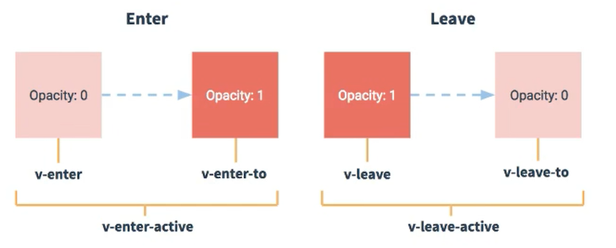

# Vue 2+3

# 01、初识vue

1. 想让Vue工作，就必须创建一个Vue实例，且传入一个配置对象；

2. root容器里的代码依然符合HTML规范，只不过混入了一些特殊的vue语法；

3. root容器里的代码被称为**vue模板**

4. 实例和容器之间是一对一的关系

5. 插值表达式  **{{   }}**  里面写的是js表达式

   

   注意区分： js表达式和js代码（语句）

      1. 表达式：一个表达式会产生一个值，可以放在任何一个需要值的地方：

         1.1 a

         1.2 a+b

         1.3 demo(1)

         1.4 x === y ? 'a': 'b'

      2. js代码（语句）

   ​       2.1 if(){}

   ​	2.2 for(){}

    

   ```html
   <!DOCTYPE html>
   <html lang="en">
   <head>
       <meta charset="UTF-8">
       <meta name="viewport" content="width=device-width, initial-scale=1.0">
       <title>初识vue</title>
       <!-- 引入vue -->
       <script type="text/javascript" src="../js/vue.js"></script>
   </head>
   <body>  
       <!-- 准备好一个容器 -->
        <div id="root">
           <h1>Hello {{name}}</h1>
        </div>
   
        <script type="text/javascript">
           Vue.config.productionTip = false  //阻止vue在启动时生成生产提示
   
           // 创建vue实例
           const x = new Vue({
               el: '#root',  //el用于指定当前Vue实例为哪个容器服务，值通常为css选择器字符串，这里的#root，选择的就是上面id="root"的那个容器
               // data中用于存储数据，数据供el所指定的容器去使用，值我们先暂时写成一个对象。
               data: {
                   name: 'world1'
               }
           })
        </script>
   </body>
   </html>
   ```


# 02、Vue模板语法


Vue模板语法有两大类：

1. 插值语法：

​		功能：用于解析标签体的内容

​		写法： {{xxx}}，xxx是js表达式，并且可以直接读取到data中的所有属性。

2. 指令语法：

   ​	功能：用于解析标签（包括：标签属性，标签体内容，绑定事件......）。

   ​	举例：v-bind:href="xxx"  或  简写为     :href="xxx"    ，xxx同样要写js表达式，并且可以直接读取到data中的所有属性。

3. 备注：Vue中有很多的指令，且形式都是  v-???   ，此处只是使用v-bind举个例子。


```HTML
<!DOCTYPE html>
<html lang="en">

<head>
    <meta charset="UTF-8">
    <meta name="viewport" content="width=device-width, initial-scale=1.0">
    <title>模板语法</title>
    <script type="text/javascript" src="../js/vue.js"></script>
</head>

<body>
    <!-- 准备好一个容器 -->
    <div id="root">
        <h1>插值语法</h1>
        <h3>你好，{{name}}</h3>
        <hr>
        <h1>指令语法</h1>
        <a v-bind:href="url">百度</a>
        <a :href="url2">哔哩哔哩</a>

    </div>

</body>
<script type="text/javascript">
    new Vue({
        el: '#root',
        data: {
            name: 'jack',
            url: 'https://www.baidu.com',
            url2: 'https://www.bilibili.com'
        }
    })
</script>

</html>
```


# 03、数据绑定


Vue中有2种数据绑定的方法：

1. 单向绑定(v-bind)：数据只能从data流向页面。

2. 双向绑定(v-model)：数据不仅能从data流向页面，还可以从页面流向data。

3. 备注：

   ​         双向绑定一般都应用在表单类元素上（如：input，select，等）。

​		v-model:value   可以简写为   v-model   ，因为v-model默认收集的就是value值。


```html
<!DOCTYPE html>
<html lang="en">

<head>
    <meta charset="UTF-8">
    <meta name="viewport" content="width=device-width, initial-scale=1.0">
    <title>数据绑定</title>
    <script type="text/javascript" src="../js/vue.js"></script>
</head>

<body>
    <!-- 准备好一个容器 -->
    <div id="root">
        <!-- 普通写法 -->
        <!-- 单向数据绑定：<input type="text" v-bind:value="name"><br>
        双向数据绑定：<input type="text" v-model:value="name"><br> -->

        <!-- 简写 -->
        单向数据绑定：<input type="text" :value="name"><br>
        双向数据绑定：<input type="text" v-model="name"><br>


        <!-- 如下代码是错误的，因为v-model只能应用在表单类元素（输入类元素）上 -->
        <!-- <h2 v-model:x="name">nihao</h2> -->
    </div>

</body>
<script type="text/javascript">
    new Vue({
        el: '#root',
        data: {
            name:'jie',
        }
    })
</script>

</html>
```


# 04、el与data的两种写法

1. el的两种写法

   （1） new Vue的时候配置el属性。

   （2） 先创建Vue实例，随后再通过vm.$mount('#root')指定el的值。

2. data的两种写法

​       （1） 对象式

​       （2） 函数式

​	 如何选择：目前哪种写法都可以，以后学习到组件时，data必须使用函数式，否则会报错。

3. 一个重要的原则：

   由Vue管理的函数，一定不要写箭头函数，一旦写了箭头函数，this就不再是Vue实例了。

```html
<!DOCTYPE html>
<html lang="en">

<head>
    <meta charset="UTF-8">
    <meta name="viewport" content="width=device-width, initial-scale=1.0">
    <title></title>
    <script type="text/javascript" src="../js/vue.js"></script>
</head>

<body>
    <!-- 准备好一个容器 -->
    <div id="root">
        <h1>你好，{{name}}</h1>
    </div>

</body>
<script type="text/javascript">
    // el的两种写法
    // const v = new Vue({
    //     // el: '#root',  第一种写法
    //     data: {
    //         name: 'jie1',
    //     }
    // })
    // console.log(v);
    // v.$mount('#root')   // 第二种写法

    // data的两种写法
    new Vue({
        el: '#root',
        // data的第一种写法：对象式
        // data: {
        //     name:'jie'
        // }

        // data的第二种写法：函数式
        data(){
            console.log('--->',this);  // 此处的this是Vue实例对象，并且不能用箭头函数，因为箭头函数没有自己的this，会向上找，就会找到window
             
            return {
                name: 'Jie'
            }
        }
    })

</script>

</html>
```


# 05、理解MVVM模型

1. M：模型（Model）：data中的数据
2. V：视图（View）：模板代码
3. VM：视图模型（ViewModel）：Vue实例

观察发现：

1. data中所有的属性，最后都出现在了vm身上。
2. vm身上所有的属性，以及Vue原型上所有的属性，在Vue模板中都可以直接使用。

```html
<!DOCTYPE html>
<html lang="en">
<head>
    <meta charset="UTF-8">
    <meta name="viewport" content="width=device-width, initial-scale=1.0">
    <title>理解MVVM</title>
    <!-- 引入vue -->
    <script type="text/javascript" src="../js/vue.js"></script>
</head>
<body>  
    <!-- 准备好一个容器 -->
     <div id="root">
        <h1>学校名称 {{name}}</h1>
        <h1>学校地址 {{address}}</h1>
        <!-- <h1>test1: {{1+1}}</h1>
        <h1>test2: {{$options}}</h1>
        <h1>test3: {{$emit}}</h1>
        <h1>test4: {{_c}}</h1> -->
     </div>

     <script type="text/javascript">
        Vue.config.productionTip = false  //阻止vue在启动时生成生产提示

        // 创建vue实例
        const vm = new Vue({
            el: '#root',  //el用于指定当前Vue实例为哪个容器服务，值通常为css选择器字符串，这里的#root，选择的就是上面id="root"的那个容器
            // data中用于存储数据，数据供el所指定的容器去使用，值我们先暂时写成一个对象。
            data: {
                name: '信阳农林',
                address: '信阳'
            }
        })
        console.log(vm);
        
     </script>
</body>
</html>
```

# 06、数据代理

## 1. 回顾Object.defineProperty

```html
<!DOCTYPE html>
<html lang="en">
<head>
    <meta charset="UTF-8">
    <meta name="viewport" content="width=device-width, initial-scale=1.0">
    <title></title>
    <!-- 引入vue -->
    <script type="text/javascript" src="../js/vue.js"></script>
</head>
<body>  
    <script type="text/javascript">
        let number = 18
        let person = {
            name: '张三',
            sex: '男',
            // age: 18
        }

        Object.defineProperty(person,'age',{
            // value:18,
            // enumerable:true,   //控制属性是否可以被 枚举，默认值是false
            // writable:true ,    //控制属性是否可以被 修改，默认值是false
            // configurable:true  //控制属性是否可以被 删除，默认值是false

            // 当有人读取Person的age属性时，get函数（geeter）就会被调用，并且返回值就是age的值
            get:function(){
                console.log('有人读取age属性了');
                
                return number
            },

            // 当有人修改Person的age属性时，set函数（seeter）就会被调用，并且会收到修改的具体值
            set(value){
                console.log('有人修改了age属性，并且值是', value);
                number = value
                
            }
        })
        console.log(person);

        console.log(Object.keys(person));
        
        

    </script>
</body>
</html>
```

## 2. 何为数据代理

```html
<!DOCTYPE html>
<html lang="en">
<head>
    <meta charset="UTF-8">
    <meta name="viewport" content="width=device-width, initial-scale=1.0">
    <title>Document</title>
</head>
<body>
    <!-- 数据代理：通过一个对象 代理对另外一个对象中的属性的操作（读/写） -->
     <script type="text/javascript">
        let obj = {x:100}
        let obj2 = {y:200}

        Object.defineProperty(obj2,'x',{
            get(){
                return obj.x
            },
            set(value){
                obj.x=value
            }
        })
     </script>
</body>
</html>
```

## 3. Vue中的数据代理


1. Vue中的数据代理：

   ​	通过vm对象来代理data对象中属性的操作（读/写）

2. Vue中数据代理的好处：

   ​	更加方便的操作data中的数据

3. 基本原理：

   ​	通过Pbject.defineProperty()把data对象中所有属性添加到vm上。

   ​	为每一个添加到vm上的属性，都指定一个getter、setter方法

   ​	在getter、setter、内部去操作（读/写)data中对应的属性。

   ```html
   <!DOCTYPE html>
   <html lang="en">
   <head>
       <meta charset="UTF-8">
       <meta name="viewport" content="width=device-width, initial-scale=1.0">
       <title></title>
       <!-- 引入vue -->
       <script type="text/javascript" src="../js/vue.js"></script>
   </head>
   <body>  
       <!-- 准备好一个容器 -->
        <div id="root">
           <h1>学校名字 {{name}}</h1>
           <h1>学校地址 {{address}}</h1>
        </div>
   
        <script type="text/javascript">
           Vue.config.productionTip = false  //阻止vue在启动时生成生产提示
   
           // 创建vue实例
           const vm = new Vue({
               el: '#root',  //el用于指定当前Vue实例为哪个容器服务，值通常为css选择器字符串，这里的#root，选择的就是上面id="root"的那个容器
               // data中用于存储数据，数据供el所指定的容器去使用，值我们先暂时写成一个对象。
               data: {
                   name: '信农',
                   address: '信阳'
               }
           })
        </script>
   </body>
   </html>
   ```


# 07、事件处理

## 1. 事件的基本使用


1. 使用v-on:xxx 或 @xxx 绑定事件，其中xxx是事件名
2. 事件的回调需要配置在methods对象中，最终会在vm上
3. methods中配置的函数，不要使用箭头函数，否则this就不是vm了
4. methods中配置的函数，都是被vue所管理的函数，this指向的是vm  或  组件实例对象
5. @click="demo" 和 @click="demo($event)" 效果一致，但后者可以传参

```html
<!DOCTYPE html>
<html lang="en">

<head>
    <meta charset="UTF-8">
    <meta name="viewport" content="width=device-width, initial-scale=1.0">
    <title>事件的基本使用</title>
    <!-- 引入vue -->
    <script type="text/javascript" src="../js/vue.js"></script>
</head>

<body>
    <!-- 准备好一个容器 -->
    <div id="root">
        <h2>欢迎来到{{name}}学习</h2>
        <!-- <button v-on:click="showInfo">点我提示信息</button> -->
        <button @click="showInfo1">点我提示信息1（不传参）</button>
        <button @click="showInfo2(66,$event)">点我提示信息2（传参）</button>
    </div>

    <script type="text/javascript">
        Vue.config.productionTip = false  //阻止vue在启动时生成生产提示

        // 创建vue实例
        const vm = new Vue({
            el: '#root',
            data: {
                name: '尚硅谷'
            },
            methods: {                
                showInfo1(event) {
                    // console.log(event.target.innerText);
                    // console.log(this);   //此处的this是vm
                    alert('info1')
                },
                showInfo2(number,event) {
                    // console.log(event.target.innerText);
                    // console.log(this);   //此处的this是vm
                    // alert('info2')
                    console.log(number,event);
                    
                }
            }
        })
    </script>
</body>

</html>
```

## 2.事件修饰符

vue中的事件修饰符：

	1. preven：阻止默认事件（常用）
	1. stop：阻止事件冒泡（常用）
	1. once：事件只触发一次（常用）
	1. capture：使用事件的捕获模式
	1. self：只有event.target是当前操作元素时才触发事件
	1. passive：事件的默认行为立即执行，无需等待事件回调执行完毕

```html
<!DOCTYPE html>
<html lang="en">
<head>
    <meta charset="UTF-8">
    <meta name="viewport" content="width=device-width, initial-scale=1.0">
    <title>事件修饰符</title>
    <!-- 引入vue -->
    <script type="text/javascript" src="../js/vue.js"></script>
</head>
<body>  
    <!-- 准备好一个容器 -->
     <div id="root">
        <h2>欢迎来到{{name}}学习</h2>
        <!-- preven：阻止默认事件（常用） -->
        <a href="https://www.baidu.com" @click.prevent="showInfo">点我提示信息</a>

        <!-- stop：阻止事件冒泡（常用） -->
         <div class="demo1" @click="showInfo">
            <button @click.stop="showInfo">点我提示信息</button>
         </div>

         <!-- once：事件只触发一次（常用） -->
         <button @click.once="showInfo">点我提示信息</button>

         <!-- capture：使用事件的捕获模式 -->
          <div class="box1" @click.capture="showMsg(1)">
            div1
            <div class="box2" @click="showMsg(2)">div2</div>
          </div>

          <!-- self：只有event.target是当前操作元素时才触发事件 -->
          <div class="demo1" @click.self="showInfo">
            <button @click="showInfo">点我提示信息</button>
         </div>

         <!-- passive：事件的默认行为立即执行，无需等待事件回调执行完毕 -->
          <ul @wheel.passive="demo" class="list">
            <li>1</li>
            <li>2</li>
            <li>3</li>
            <li>4</li>
          </ul>
     </div>

     <script type="text/javascript">
        Vue.config.productionTip = false  //阻止vue在启动时生成生产提示

        // 创建vue实例
        const vm = new Vue({
            el: '#root',  
            data: {
                name: '尚硅谷'
            },
            methods: {
                showInfo(e){
                    alert('info')
                    // console.log(e.target);
                    
                },
                showMsg(msg){
                    console.log(msg);
                    
                },
                demo(){
                    // console.log('@');
                    
                    for (let index = 0; index < 10000; index++) {
                        console.log('%');
                    }
                    console.log('循环结束了');
                    
                }
            }
        })
     </script>
</body>
<style>
    *{
        margin-top: 20px;
    }
    .demo1{
        height: 50px;
        background-color: skyblue;
    }
    .box1{
        padding: 5px;
        background-color: skyblue;
    }
    .box2{
        padding: 5px;
        background-color: pink;
    }
    .list{
        width: 200px;
        height: 200px;
        background-color: skyblue;
        overflow: auto;
        li{
            height: 100px;
        }
    }
</style>
</html>
```

## 3.键盘事件

1. Vue中常用的按键别名

​		回车：enter

​		删除：delete  (捕获”删除“和”退格“，这两个按键，即delete和backspace)

​		退出：esc

​		空格：space

​		换行：tab（特殊，必须配合keydown使用，不然按下tab之后焦点被移走，绑定的keyup方法就不会被执行）

​		上下左右： up  down  left  right

2. Vue中未提供别名的按键，可以使用按键原始的key值去绑定，但是要注意转为kebab-case（短横线命名）。	

 		例如：CapsLock要写成caps-lock  使用的时候就是  @keyup.caps-lock="showInfo"

3. 系统修饰键（用法特殊）：ctrl  shift   alt  meta

​		配合keyup使用，按下修饰键的同时，再按下其他按键，随后释放其他按键，绑定的事件才会触发

​		配合keydown使用，正常触发事件

​		@keyup.ctrl.y    这样绑定的就是ctrl+y的keyup事件，ctrl+其他按键不再触发事件

4. 也可以使用keyCode去指定具体的按键（不推荐，将会废除）
5. Vue.config.keyCode.自定义键名 = 键码，可以去定制按键别名

```htmL
<!DOCTYPE html>
<html lang="en">
<head>
    <meta charset="UTF-8">
    <meta name="viewport" content="width=device-width, initial-scale=1.0">
    <title>键盘事件</title>
    <!-- 引入vue -->
    <script type="text/javascript" src="../js/vue.js"></script>
</head>
<body>  
    <!-- 准备好一个容器 -->
     <div id="root">
        <input type="text" placeholder="按下回车提示输入" @keyup.enter="showInfo">
     </div>

     <script type="text/javascript">
        Vue.config.productionTip = false  //阻止vue在启动时生成生产提示

        // 创建vue实例
        const vm = new Vue({
            el: '#root',  
            data: {
                
            },
            methods:{
                showInfo(e){
                    // console.log(e.keyCode);
                    // if(e.keyCode !== 13){
                    //     return
                    // }
                    console.log(e.target.value);
                    
                }
            }
        })
     </script>
</body>
</html>
```

# 08、计算属性

## 1.姓名案例_插值语法实现

```html
<!DOCTYPE html>
<html lang="en">
<head>
    <meta charset="UTF-8">
    <meta name="viewport" content="width=device-width, initial-scale=1.0">
    <title></title>
    <!-- 引入vue -->
    <script type="text/javascript" src="../js/vue.js"></script>
</head>
<body>  
    <!-- 准备好一个容器 -->
     <div id="root">
        姓: <input type="text" v-model="firstName"> <br> 
        名: <input type="text" v-model="lastName"> <br>
        全名：<span>{{firstName.slice(0,3)}}-{{lastName}}</span>
     </div>

     <script type="text/javascript">
        Vue.config.productionTip = false  //阻止vue在启动时生成生产提示

        // 创建vue实例
        const vm = new Vue({
            el: '#root',  
            data: {
                firstName: '张',
                lastName: '三'
            }
        })
     </script>
</body>
</html>
```

## 2.姓名案例_methods实现

```html
<!DOCTYPE html>
<html lang="en">
<head>
    <meta charset="UTF-8">
    <meta name="viewport" content="width=device-width, initial-scale=1.0">
    <title></title>
    <!-- 引入vue -->
    <script type="text/javascript" src="../js/vue.js"></script>
</head>
<body>  
    <!-- 准备好一个容器 -->
     <div id="root">
        姓: <input type="text" v-model="firstName"> <br> 
        名: <input type="text" v-model="lastName"> <br>
        全名：<span>{{fullName()}}</span>
     </div>

     <script type="text/javascript">
        Vue.config.productionTip = false  //阻止vue在启动时生成生产提示

        // 创建vue实例
        const vm = new Vue({
            el: '#root',  
            data: {
                firstName: '张',
                lastName: '三'
            },
            methods:{
                fullName(){
                    return this.firstName + '-' + this.lastName
                }
            }
        })
     </script>
</body>
</html>
```

## 3.姓名案例_计算属性实现

计算属性：

	1. 定义：要用的属性不存在，需要通过已有属性计算得来。
	1. 原理：底层借助了Object.defineproperty方法提供的getter和setter
	1. get函数什么时候执行？

​		（1）初次读取时会执行一次。

​		（2）当依赖的数据发生改变时会被再次调用

4. 优势：与methods实现相比。内部有缓存机制（复用），效率更高，调试方便。

5. 备注：

    ​	（1）计算属性最终会出现在vm上，直接读取使用即可。	

   ​	（2）如果计算属性要被修改，那么必须写set函数去响应修改，并且set中要引起计算时依赖的数据发生改变（就是在set里把用到的数据改成新数据）。

   ```html
   <!DOCTYPE html>
   <html lang="en">
   <head>
       <meta charset="UTF-8">
       <meta name="viewport" content="width=device-width, initial-scale=1.0">
       <title></title>
       <!-- 引入vue -->
       <script type="text/javascript" src="../js/vue.js"></script>
   </head>
   <body>  
       <!-- 准备好一个容器 -->
        <div id="root">
           姓: <input type="text" v-model="firstName"> <br> 
           名: <input type="text" v-model="lastName"> <br>
           全名：<span>{{fullName}}</span>
        </div>
   
        <script type="text/javascript">
           Vue.config.productionTip = false  //阻止vue在启动时生成生产提示
   
           // 创建vue实例
           const vm = new Vue({
               el: '#root',  
               data: {
                   firstName: '张',
                   lastName: '三'
               },
               computed: {
                   fullName: {
                       // get有什么作用？当有人读取fullName时，get就会被调用，并且返回值就作为fullName的值
                       // get什么时候调用？1.初次读取fullName时    2.所依赖的数据发生变化时
                       get(){
                           // 这里的this是vm
                           console.log(this);
                           return this.firstName + '-' + this.lastName
                       },
                       // set什么时候调用？当fullName被修改时
                       set(value){
                           console.log(value);
                           const arr = value.split('-')
                           this.firstName = arr[0]
                           this.lastName = arr[1]
                       }
                   }
               }
           })
        </script>
   </body>
   </html>
   ```

   ## 4.姓名案例_计算属性简写

   简写：只有geter没有setter的时候可以简写

   ```html
   <!DOCTYPE html>
   <html lang="en">
   <head>
       <meta charset="UTF-8">
       <meta name="viewport" content="width=device-width, initial-scale=1.0">
       <title></title>
       <!-- 引入vue -->
       <script type="text/javascript" src="../js/vue.js"></script>
   </head>
   <body>  
       <!-- 准备好一个容器 -->
        <div id="root">
           姓: <input type="text" v-model="firstName"> <br> 
           名: <input type="text" v-model="lastName"> <br>
           全名：<span>{{fullName}}</span>
        </div>
   
        <script type="text/javascript">
           Vue.config.productionTip = false  //阻止vue在启动时生成生产提示
   
           // 创建vue实例
           const vm = new Vue({
               el: '#root',  
               data: {
                   firstName: '张',
                   lastName: '三'
               },
               computed: {
                   // 完整写法
                   // fullName: {
                   //     get(){
                   //         return this.firstName + '-' + this.lastName
                   //     },
                   //     set(value){
                   //         console.log(value);
                   //         const arr = value.split('-')
                   //         this.firstName = arr[0]
                   //         this.lastName = arr[1]
                   //     }
                   // }
   
                   // 简写
                   fullName(){
                       return this.firstName + '-' + this.lastName
                   }
               }
           })
        </script>
   </body>
   </html>
   ```


# 09、监视属性

## 1.天气案例

```html
<!DOCTYPE html>
<html lang="en">
<head>
    <meta charset="UTF-8">
    <meta name="viewport" content="width=device-width, initial-scale=1.0">
    <title></title>
    <!-- 引入vue -->
    <script type="text/javascript" src="../js/vue.js"></script>
</head>
<body>  
    <!-- 准备好一个容器 -->
     <div id="root">
        <h2>今天天气很{{info}}</h2>
        <!-- 绑定事件的时候：@xxx='yyy' yyy可以写一些简单的语句-->
        <!-- <button @click="isHot = !isHot">切换天气</button> -->
        <button @click="changeWeather">切换天气</button>
     </div>

     <script type="text/javascript">
        Vue.config.productionTip = false  //阻止vue在启动时生成生产提示
        // Vue.config.devtools = true

        // 创建vue实例
        const vm = new Vue({
            el: '#root',  
            data: {
                isHot: true
            },
            computed:{
                info(){
                    return this.isHot ? '炎热':'凉爽'
                }
            },
            methods: {
                changeWeather(){
                    this.isHot =  !(this.isHot)
                }
            },
        })
     </script>
</body>
</html>
```

## 2.天气案例-监视属性

监视属性watch:

1. 当被监视的属性变化时，回调函数自动调用，进行相关操作
2. 监视的属性必须存在，才能进行监视！！
3. 监视的两种写法：
   1. new Vue时传入watch配置
   2. 通过vm.$watch监视

```html
<!DOCTYPE html>
<html lang="en">

<head>
    <meta charset="UTF-8">
    <meta name="viewport" content="width=device-width, initial-scale=1.0">
    <title></title>
    <!-- 引入vue -->
    <script type="text/javascript" src="../js/vue.js"></script>
</head>

<body>
    <!-- 准备好一个容器 -->
    <div id="root">
        <h2>今天天气很{{info}}</h2>
        <button @click="changeWeather">切换天气</button>
    </div>

    <script type="text/javascript">
        Vue.config.productionTip = false  //阻止vue在启动时生成生产提示
        // Vue.config.devtools = true

        // 创建vue实例
        const vm = new Vue({
            el: '#root',
            data: {
                isHot: true
            },
            computed: {
                info() {
                    return this.isHot ? '炎热' : '凉爽'
                }
            },
            methods: {
                changeWeather() {
                    this.isHot = !(this.isHot)
                }
            },
            watch: {
                isHot: {
                    // immediate默认值是false，初始化时让handler调用一次 
                    immediate: true,
                    // handler(),当isHot发生改变时调用
                    handler(newValue, oldValue) {
                        console.log('isHot被修改了', newValue, oldValue);

                    }
                }
            }
        })

        vm.$watch('isHot', {
            immediate: true,
            // handler(),当isHot发生改变时调用
            handler(newValue, oldValue) {
                console.log('isHot被修改了', newValue, oldValue);
            }
        })
    </script>
</body>

</html>
```

## 3.深度监视

深度监视：

1. Vue中的watch默认不监测对象内部值的改变（一层）。
2. 配置deep:true可以检测对象内部值的改变（多层）。

备注：

1. Vue自身可以检测对象内部值的改变，但Vue提供的watch默认不可以
2. 使用watch时根据数据的具体结构，决定是否采用深度监视。

```html
<!DOCTYPE html>
<html lang="en">

<head>
    <meta charset="UTF-8">
    <meta name="viewport" content="width=device-width, initial-scale=1.0">
    <title></title>
    <!-- 引入vue -->
    <script type="text/javascript" src="../js/vue.js"></script>
</head>

<body>
    <!-- 准备好一个容器 -->
    <div id="root">
        <h2>今天天气很{{info}}</h2>
        <button @click="changeWeather">切换天气</button>
        <br>
        <h2>a的值是{{numbers.a}}</h2>
        <button @click="numbers.a+=1">a+1</button>
        <br>
        <h2>b的值是{{numbers.b}}</h2>
        <button @click="numbers.b+=1">b+1</button>
        <button @click="numbers={a:666,b:888}">彻底替换numbers</button>

    </div>

    <script type="text/javascript">
        Vue.config.productionTip = false  //阻止vue在启动时生成生产提示
        // Vue.config.devtools = true

        // 创建vue实例
        const vm = new Vue({
            el: '#root',
            data: {
                isHot: true,
                numbers: {
                    a: 1,
                    b: 1
                }
            },
            computed: {
                info() {
                    return this.isHot ? '炎热' : '凉爽'
                }
            },
            methods: {
                changeWeather() {
                    this.isHot = !(this.isHot)
                }
            },
            watch: {
                isHot: {
                    // immediate默认值是false，初始化时让handler调用一次 
                    // immediate: true,
                    // handler(),当isHot发生改变时调用
                    handler(newValue, oldValue) {
                        console.log('isHot被修改了', newValue, oldValue);
                    }
                },
                // 监视多级属性中某一个属性是否发生变化
                'numbers.a': {
                    deep:true,
                    handler() {
                        console.log('a变化了');
                    }
                },
                // 监视多级属性中所有属性是否产生变化
                'numbers': {
                    // 深度监视开关，默认为false，默认不深层监视
                    deep:true,
                    handler() {
                        console.log('numbers变化了');
                    }
                }
            }
        })
    </script>
</body>

</html>
```

## 4.深度监视简写

```html
<!DOCTYPE html>
<html lang="en">

<head>
    <meta charset="UTF-8">
    <meta name="viewport" content="width=device-width, initial-scale=1.0">
    <title></title>
    <!-- 引入vue -->
    <script type="text/javascript" src="../js/vue.js"></script>
</head>

<body>
    <!-- 准备好一个容器 -->
    <div id="root">
        <h2>今天天气很{{info}}</h2>
        <button @click="changeWeather">切换天气</button>
    </div>

    <script type="text/javascript">
        Vue.config.productionTip = false  //阻止vue在启动时生成生产提示
        // Vue.config.devtools = true

        // 创建vue实例
        const vm = new Vue({
            el: '#root',
            data: {
                isHot: true,
            },
            computed: {
                info() {
                    return this.isHot ? '炎热' : '凉爽'
                }
            },
            methods: {
                changeWeather() {
                    this.isHot = !(this.isHot)
                }
            },
            watch: {
                // 完整写法
                // isHot: {
                //     // immediate: true,     // 默认值是false，初始化时让handler调用一次 
                //     // deep: true,   // 深度监视
                //     handler(newValue, oldValue) {
                //         console.log('isHot被修改了', newValue, oldValue);
                //     }
                // }

                // 简写
                isHot() {
                    console.log('isHot被修改了', newValue, oldValue);
                }
            } 
        })

        // 完整写法
        // vm.$watch('isHot', {
        //     immediate: true,     // 默认值是false，初始化时让handler调用一次 
        //     deep: true,   // 深度监视
        //     handler(newValue, oldValue) {
        //         console.log('isHot被修改了', newValue, oldValue);
        //     }
        // })

        vm.$watch('isHot',function handler(newValue,oldValue){
            console.log('isHot被修改了', newValue, oldValue);
        })
    </script>
</body>

</html>
```

## 5.watch对比computed

computed和watch之间的区别：

1. computed能完成的功能，watch都可以完成。
2. watch能完成的功能，computed不一定能完成，例如：watch可以进行异步操作。

两个重要的小原则：

1. 所被Vue管理的函数，最好写成普通函数，这样this的指向才是vm 或 组件实例对象。
2. 所有不被Vue所管理的函数（定时器的回调函数，Ajax的回调函数等，Promise的回调函数）最好写成箭头函数
3. 这样this的指向才是vm 或 组件实例对象。

```html
<!DOCTYPE html>
<html lang="en">

<head>
    <meta charset="UTF-8">
    <meta name="viewport" content="width=device-width, initial-scale=1.0">
    <title></title>
    <!-- 引入vue -->
    <script type="text/javascript" src="../js/vue.js"></script>
</head>

<body>
    <!-- 准备好一个容器 -->
    <div id="root">
        姓: <input type="text" v-model="firstName"> <br>
        名: <input type="text" v-model="lastName"> <br>
        全名：<span>{{fullName}}</span>
    </div>

    <script type="text/javascript">
        Vue.config.productionTip = false  //阻止vue在启动时生成生产提示

        // 创建vue实例
        const vm = new Vue({
            el: '#root',
            data: {
                firstName: '张',
                lastName: '三',
                fullName: '张-三'
            },
            computed: {

            },
            watch: {
                firstName: {
                    handler(newValue, oldValue) {
                        setTimeout(() => {
                            console.log(newValue, oldValue);
                            vm.fullName = newValue +'-'+ vm.lastName;
                        }, 3000);
                    }
                },
                lastName: {
                    handler(newValue, oldValue) {
                        console.log(newValue, oldValue);
                        vm.fullName = vm.firstName +'-'+ newValue;
                    }
                },
            }

        })
    </script>
</body>

</html>
```

# 10、绑定样式

1. class样式

​	写法：class='xxx'  xxx可以是字符串，对象，数组

​		字符串写法，适用于样式的类名不确定，需要动态指定

​		对象写法，适用于样式的个数确定，类名也确定，但是要动态决定用不用

​		数组写法，适用于样式的个数不确定，类名也不确定

2. style样式

​		:style = "{fintSize:xxx}" 其中xxx是动态值

​		:style = "[a,b]"  其中a、b是样式对象。

```html
<!DOCTYPE html>
<html lang="en">

<head>
    <meta charset="UTF-8">
    <meta name="viewport" content="width=device-width, initial-scale=1.0">
    <title>绑定样式</title>
    <!-- 引入vue -->
    <script type="text/javascript" src="../js/vue.js"></script>
</head>

<body>
    <!-- 准备好一个容器 -->
    <div id="root">
        <!-- 绑定class样式 字符串写法，适用于样式的类名不确定，需要动态指定 -->
        <div class="basic" :class="mood" @click="changeMood">test</div>
        <br><br>
        <!-- 绑定class样式 数组写法，适用于样式的个数不确定，类名也不确定 -->
        <div class="basic" :class="classArr">test</div>
        <br><br>
        <!-- 绑定class样式 对象写法，适用于样式的个数确定，类名也确定，但是要动态决定用不用 -->
        <div class="basic" :class="classObj">test</div>

        <br>
        <!-- 绑定style样式，对象写法 -->
        <div class="basic" :style="styleObj">test</div>
    </div>

    <script type="text/javascript">
        Vue.config.productionTip = false  //阻止vue在启动时生成生产提示

        // 创建vue实例
        const vm = new Vue({
            el: '#root',
            data: {
                mood: 'normal',
                classArr: ['class1', 'class2', 'class3'],
                classObj: {
                    class1: true,
                    class2: true
                },
                styleObj: {
                    fontSize: '40px',
                    color: 'red',
                    backgroundColor: 'orange'
                }
            },
            methods: {
                changeMood() {
                    moodArr = ['happy', 'normal', 'sad']
                    let index = Math.floor(Math.random() * 3)
                    this.mood = moodArr[index]
                }
            },
        })
    </script>
</body>
<style>
    .basic {
        width: 200px;
        height: 200px;
        border: 2px black solid;
    }

    .happy {
        background: linear-gradient(45deg, #fada61 0.000%, #ff9188 50.000%, #ff5acd 100.000%);
    }

    .sad {
        background: linear-gradient(90deg, #a47451 0.000%, #9c9881 16.667%, #73a09d 33.333%, #3b899a 50.000%, #095b79 66.667%, #002847 83.333%, #000116 100.000%);
    }

    .normal {
        background: linear-gradient(45deg, #8ec5fc 0.000%, #8dd3ff 25.000%, #a1d8ff 50.000%, #c1d2ff 75.000%, #e0c3ff 100.000%);
    }

    .class1 {
        background-color: rgb(156, 225, 156);
    }

    .class2 {
        font-size: x-large;
        text-shadow: 5px 5px 5px #ffb0b0;
    }

    .class3 {
        border-radius: 20px;
    }
</style>

</html>
```

# 11、条件渲染

1. v-if

   ​	（1）v-if="表达式"

​		（2）v-else-if="表达式"

​		（3）v-else="表达式"

​	适用于：切换频率低的场景

​	特点：不展示的DOM元素将会被直接移除

​	注意：v-if可以和，v-else-if，v-else一起使用，但他们必须连续使用，中间不能被打断

2. v-show

​	写法v-show="表达式"

​	适用于：切换频率高的场景

​	特点：不展示的DOM元素未被移除，仅仅是使用  display：none  样式隐藏掉

3. 备注：使用v-if时，元素可能无法获取到，但使用v-show一定可以获取到

```html
<!DOCTYPE html>
<html lang="en">

<head>
    <meta charset="UTF-8">
    <meta name="viewport" content="width=device-width, initial-scale=1.0">
    <title></title>
    <!-- 引入vue -->
    <script type="text/javascript" src="../js/vue.js"></script>
</head>

<body>
    <!-- 准备好一个容器 -->
    <div id="root">

        <!-- 使用v-show做条件渲染 -->
        <h2 v-show="true">欢迎来到{{name}}</h2>
        <!-- 使用v-if做条件渲染 -->
        <h2 v-if="false">欢迎来到{{name}}</h2>
        <hr>
        <h2>{{n}}</h2>
        <button @click="n++">点我N+1</button>
        <h2 v-show="n === 1">n=1</h2>
        <h2 v-show="n === 2">n=2</h2>
        <h2 v-show="n === 3">n=3</h2>
        <hr>
        <h2 v-if="n === 1">n=1</h2>
        <h2 v-if="n === 2">n=2</h2>
        <h2 v-if="n === 3">n=3</h2>
        <hr>
        <!-- v-if配合v-else-if配合v-else，他们三个不允许中间断掉，必须连续使用 -->
        <h2 v-if="n === 1">n=1</h2>
        <h2 v-else-if="n === 2">n=2</h2>
        <h2 v-else-if="n === 3">n=3</h2>
        <h2 v-else>n不是1，2，3</h2>
        <!-- v-if配合template，
             template不会影响页面结构，在渲染的时候不会加载，而是直接加载template内部的结构
             所以不能配合v-show使用，只能配合v-if -->
        <template v-if="n === 4">
            <h2>template</h2>
            <h2>template</h2>
            <h2>template</h2>
        </template>
    </div>

    <script type="text/javascript">
        Vue.config.productionTip = false  //阻止vue在启动时生成生产提示

        // 创建vue实例
        const vm = new Vue({
            el: '#root',
            data: {
                name: '尚硅谷',
                a: false,
                n: 0
            }
        })
    </script>
</body>

</html>
```

# 12、列表渲染

## 1.列表渲染

v-for指令：

	1. 用于展示列表数据
	1. 语法：v-for="(item,index) in  xxx" :key="yyy"
	1. 可遍历：数组、对象、字符串（用的很少），指定次数（用的很少）

```vue
<!DOCTYPE html>
<html lang="en">

<head>
    <meta charset="UTF-8">
    <meta name="viewport" content="width=device-width, initial-scale=1.0">
    <title>基本列表</title>
    <!-- 引入vue -->
    <script type="text/javascript" src="../js/vue.js"></script>
</head>

<body>
    <!-- 准备好一个容器 -->
    <div id="root">
        <!-- 遍历数组 -->
        <h2>人员列表</h2>
        <ul>
            <li v-for="(person,index) in persons" :key="index">
                {{person.name}}-{{person.age}}
            </li>
        </ul>
        <!-- 遍历对象 -->
        <h2>车辆信息</h2>
        <ul>
            <li v-for="(value,key) in car" :key="key">
                {{key}}-{{value}}
            </li>
        </ul>
        <!-- 遍历字符串 -->
        <h2>遍历字符串：hello（用的少）</h2>
        <ul>
            <li v-for="(str,index) in str" :key="index">
                {{str}}-{{index}}
            </li>
        </ul>
        <!-- 遍历指定次数 -->
         <h2>遍历指定次数（用的少）</h2>
        <ul>
            <li v-for="(numbers,index) in 5" :key="index">
                {{numbers}}-{{index}}
            </li>
        </ul>
    </div>

    <script type="text/javascript">
        Vue.config.productionTip = false  //阻止vue在启动时生成生产提示

        // 创建vue实例
        const vm = new Vue({
            el: '#root',
            data: {
                persons: [
                    { id: '001', name: '张三', age: '18' },
                    { id: '002', name: '李四', age: '19' },
                    { id: '003', name: '王五', age: '20' }
                ],
                car: {
                    name: "奥迪",
                    color: 'red',
                    price: '50万'
                },
                str: 'hello'
            }
        })
    </script>
</body>

</html>
```

## 2.key的原理

面试题：react,Vue中的key有什么作用？（key的内部原理）

1. 虚拟dom中key的作用：

   ​	key是虚拟dom对象的标识，当状态中的数据发生变化时，vue会根据【新数据】生成【新的虚拟dom】

   ​	随后Vue进行【新虚拟dom】与【旧虚拟dom】的差异比较，比较规则如下：

2. 对比规则：

​		（1）旧虚拟dom中找到了与新虚拟dom中相同的key

​				若虚拟dom中内容没变，直接使用之前的真实dom

​				若虚拟dom中内容变了，则生成新的真是dom，随后替换掉页面中之前的真实dom

​		（2）旧虚拟dom中未找到与新虚拟dom相同的key

​				创建新的真实dom，随后渲染到页面。

3. 用index作为key可能会引发的问题：

​		（1）若对数据进行：逆序添加，逆序删除等破坏顺序的操作：

​				会产生没有必要的真实dom更新 ===>   界面效果没问题，但效率低

​		（2）如果结构中还包含输入类dom:

​				会产生错误dom更新  ===>  界面有问题

4. 开发中如何选择key?

​		（1）最好使用每条数据的唯一标识作为key，比如id,手机号，身份证号，学号等

​		（2）如果不存在对数据的逆序添加，逆序删除等破坏顺序的操作，仅用于渲染列表用于展示，使用index作为key是没有问题的。

```html
<!DOCTYPE html>
<html lang="en">

<head>
    <meta charset="UTF-8">
    <meta name="viewport" content="width=device-width, initial-scale=1.0">
    <title>基本列表</title>
    <!-- 引入vue -->
    <script type="text/javascript" src="../js/vue.js"></script>
</head>

<body>
    <!-- 准备好一个容器 -->
    <div id="root">
        <!-- 遍历数组 -->
        <h2>人员列表</h2>
        <button @click="add">添加一个老刘</button>
        <ul>
            <li v-for="(person,index) in persons" :key="index">
                {{person.name}}-{{person.age}}
                <input type="text">
            </li>
        </ul>
    </div>

    <script type="text/javascript">
        Vue.config.productionTip = false  //阻止vue在启动时生成生产提示

        // 创建vue实例
        const vm = new Vue({
            el: '#root',
            data: {
                persons: [
                    { id: '001', name: '张三', age: '18' },
                    { id: '002', name: '李四', age: '19' },
                    { id: '003', name: '王五', age: '20' }
                ]
            },
            methods: {
                add(){
                    let Liu = {id: '004', name: '老刘', age: '40'};
                    this.persons.unshift(Liu)
                }
            },
        })
    </script>
</body>

</html>
```

## 3.列表过滤

```html
<!DOCTYPE html>
<html lang="en">

<head>
    <meta charset="UTF-8">
    <meta name="viewport" content="width=device-width, initial-scale=1.0">
    <title>列表过滤</title>
    <!-- 引入vue -->
    <script type="text/javascript" src="../js/vue.js"></script>
</head>

<body>
    <!-- 准备好一个容器 -->
    <div id="root">
        <!-- 遍历数组 -->
        <h2>人员列表</h2>
        <input type="text" placeholder="请输入名字" v-model="inputName">
        <ul>
            <li v-for="(person,index) in filePersons" :key="index">
                {{person.name}}-{{person.age}}-{{person.sex}}
            </li>
        </ul>
    </div>

    <script type="text/javascript">
        Vue.config.productionTip = false  //阻止vue在启动时生成生产提示

        // 创建vue实例
        const vm = new Vue({
            el: '#root',
            // 用watch实现
            // data: {
            //     persons: [
            //         { id: '001', name: '马冬梅', age: '18', sex: '女' },
            //         { id: '002', name: '周冬雨', age: '19', sex: '女' },
            //         { id: '003', name: '周杰伦', age: '20', sex: '男' },
            //         { id: '004', name: '温兆伦', age: '21', sex: '男' }
            //     ],
            //     filePersons: [],
            //     inputName: []
            // },
            // watch: {
            //     inputName: {
            //         immediate: true,
            //         handler(newValue) {
            //             this.filePersons = this.persons.filter((person => {
            //                 return person.name.indexOf(newValue) !== -1
            //             }))
            //         }
            //     }
            // }

            // computed实现
            data: {
                persons: [
                    { id: '001', name: '马冬梅', age: '28', sex: '女' },
                    { id: '002', name: '周冬雨', age: '29', sex: '女' },
                    { id: '003', name: '周杰伦', age: '20', sex: '男' },
                    { id: '004', name: '温兆伦', age: '11', sex: '男' }
                ],
                inputName: []
            },
            computed: {
                filePersons:{
                    get(){
                        return this.persons.filter((person)=>{
                            return person.name.indexOf(this.inputName) !== -1
                        })
                    }
                }
            }
        })
    </script>
</body>

</html>
```

## 4.列表排序

```html
<!DOCTYPE html>
<html lang="en">

<head>
    <meta charset="UTF-8">
    <meta name="viewport" content="width=device-width, initial-scale=1.0">
    <title>列表排序</title>
    <!-- 引入vue -->
    <script type="text/javascript" src="../js/vue.js"></script>
</head>

<body>
    <!-- 准备好一个容器 -->
    <div id="root">
        <!-- 遍历数组 -->
        <h2>人员列表</h2>
        <input type="text" placeholder="请输入名字" v-model="inputName">
        <button @click="sortType=2">年龄升序</button>
        <button @click="sortType=1">年龄降序</button>
        <button @click="sortType=0">原顺序</button>
        <ul>
            <li v-for="(person,index) in filePersons" :key="index">
                {{person.name}}-{{person.age}}-{{person.sex}}
            </li>
        </ul>
    </div>

    <script type="text/javascript">
        Vue.config.productionTip = false  //阻止vue在启动时生成生产提示

        // 创建vue实例
        const vm = new Vue({
            el: '#root',
            data: {
                persons: [
                    { id: '001', name: '马冬梅', age: '28', sex: '女' },
                    { id: '002', name: '周冬雨', age: '29', sex: '女' },
                    { id: '003', name: '周杰伦', age: '20', sex: '男' },
                    { id: '004', name: '温兆伦', age: '11', sex: '男' }
                ],
                inputName: [],
                sortType: 0,   //0是原顺序，1是降序，2是升序
            },
            computed: {
                filePersons:{
                    get(){
                        let sortPerson = this.persons.filter((person)=>{
                            return person.name.indexOf(this.inputName) !== -1
                        });
                        if (this.sortType != 0) {
                            sortPerson.sort((p1, p2)=>{
                                return this.sortType === 2 ? p1.age-p2.age : p2.age-p1.age
                            })
                        }
                        return sortPerson
                    }
                }
            }
        })
    </script>
</body>

</html>
```

## 5.更新时的一个问题

```html
<!DOCTYPE html>
<html lang="en">

<head>
    <meta charset="UTF-8">
    <meta name="viewport" content="width=device-width, initial-scale=1.0">
    <title>更新时的一个问题</title>
    <!-- 引入vue -->
    <script type="text/javascript" src="../js/vue.js"></script>
</head>

<body>
    <!-- 准备好一个容器 -->
    <div id="root">
        <!-- 遍历数组 -->
        <h2>人员列表</h2>
        <button @click="updateMei">修改马冬梅的信息</button>
        <ul>
            <li v-for="(person,index) in persons" :key="person.id">
                {{person.name}}-{{person.age}}-{{person.sex}}
            </li>
        </ul>
    </div>

    <script type="text/javascript">
        Vue.config.productionTip = false  //阻止vue在启动时生成生产提示

        // 创建vue实例
        const vm = new Vue({
            el: '#root',
            data: {
                persons: [
                    { id: '001', name: '马冬梅', age: '28', sex: '女' },
                    { id: '002', name: '周冬雨', age: '29', sex: '女' },
                    { id: '003', name: '周杰伦', age: '20', sex: '男' },
                    { id: '004', name: '温兆伦', age: '11', sex: '男' }
                ]
            },
            methods: {
                updateMei(){
                    // 奏效
                    // this.persons[0].name = '马东';
                    // this.persons[0].age = '19';
                    // this.persons[0].sex = '男';

                    // vue没检测到修改，不奏效
                    // this.persons[0] = { id: '001', name: '马冬', age: '19', sex: '男' }

                    // 奏效
                    this.persons.splice(0,1,{ id: '001', name: '马冬', age: '19', sex: '男' })
                }
            },
        })
    </script>
</body>

</html>
```

## 6.Vue监测数据改变的原理-对象

```html
<!DOCTYPE html>
<html lang="en">

<head>
    <meta charset="UTF-8">
    <meta name="viewport" content="width=device-width, initial-scale=1.0">
    <title></title>
    <!-- 引入vue -->
    <script type="text/javascript" src="../js/vue.js"></script>
</head>

<body>
    <!-- 准备好一个容器 -->
    <div id="root">
        <h2>学校名称：{{name}}</h2>
        <h2>学校地址：{{address}}</h2>
    </div>

    <script type="text/javascript">
        Vue.config.productionTip = false  //阻止vue在启动时生成生产提示

        // 创建vue实例
        const vm = new Vue({
            el: '#root',
            data: {
                name: '尚硅谷',
                address: '北京',
                student: {
                    name:'tom',
                    age:{
                        rAge:18,
                        sAge:29
                    },
                    friends:[{name:'lihua',age:18}]
                }
            }
        })
    </script>
</body>

</html>
```

## 7.模拟一个数据监测

```html
<!DOCTYPE html>
<html lang="en">

<head>
    <meta charset="UTF-8">
    <meta name="viewport" content="width=device-width, initial-scale=1.0">
    <title>Document</title>
</head>

<body>


</body>
<script>
    let data = {
        name: '尚硅谷',
        address: '北京',
        a: {
            b: 1
        }
    }
    // 创建一个监视的实例对象，用于监测data中属性的变化
    let obs = new Observer(data);
    console.log(obs);
    // 准备一个vm实例对象
    let vm = {}
    console.log(vm);
    vm._data = data = obs

    function Observer(obj) {
        let keys = Object.keys(obj)

        // 遍历
        keys.forEach((k) => {
            Object.defineProperty(this, k, {
                get() {
                    return obj[k];
                },
                set(val) {
                    console.log(`${k}被修改了，我要去解析模板，生成虚拟dom....`);
                    obj[k] = val;
                }
            })
        })

    }
</script>

</html>
```

## 8.Vue.set的使用

```html
<!DOCTYPE html>
<html lang="en">

<head>
    <meta charset="UTF-8">
    <meta name="viewport" content="width=device-width, initial-scale=1.0">
    <title></title>
    <!-- 引入vue -->
    <script type="text/javascript" src="../js/vue.js"></script>
</head>

<body>
    <!-- 准备好一个容器 -->
    <div id="root">
        <h1>学校信息</h1>
        <h2>学校名称：{{name}}</h2>
        <h2>学校地址：{{address}}</h2>
        <h2>校长是:{{leader}}</h2>
        <hr>
        <h1>学生信息</h1>
        <button @click="addSex">添加一个性别信息，默认值为男</button>
        <h2>姓名：{{student.name}}</h2>
        <h2 v-if="student.sex">性别：{{student.sex}}</h2>
        <h2>年龄：真实{{student.age.rAge}},对外：{{student.age.sAge}}</h2>
        <h2>朋友们</h2>
        <ul>
            <li v-for="(f,index) in student.friends" ::key="index">
                {{f.name}}---{{f.age}}
            </li>
        </ul>
    </div>

    <script type="text/javascript">
        Vue.config.productionTip = false  //阻止vue在启动时生成生产提示

        // 创建vue实例
        const vm = new Vue({
            el: '#root',
            data: {
                name: '尚硅谷',
                address: '北京',
                student: {
                    name: 'tom',
                    age: {
                        rAge: 18,
                        sAge: 29
                    },
                    friends: [{ name: 'lihua', age: 18 }, { name: 'tony', age: 36 }]
                }
            },
            methods: {
                addSex(){
                    // Vue.set(this.student,'sex','男')
                    this.$set(this.student,'sex','男')
                }
            },
        })
    </script>
</body>

</html>
```

## 9.Vue监测数据改变的原理-数组

```html
<!DOCTYPE html>
<html lang="en">

<head>
    <meta charset="UTF-8">
    <meta name="viewport" content="width=device-width, initial-scale=1.0">
    <title></title>
    <!-- 引入vue -->
    <script type="text/javascript" src="../js/vue.js"></script>
</head>

<body>
    <!-- 准备好一个容器 -->
    <div id="root">
        <h1>学校信息</h1>
        <h2>学校名称：{{name}}</h2>
        <h2>学校地址：{{address}}</h2>
        <h2>校长是:{{leader}}</h2>
        <hr>
        <h1>学生信息</h1>
        <button @click="addSex">添加一个性别信息，默认值为男</button>
        <h2>姓名：{{student.name}}</h2>
        <h2 v-if="student.sex">性别：{{student.sex}}</h2>
        <h2>年龄：真实{{student.age.rAge}},对外：{{student.age.sAge}}</h2>
        <h2>爱好</h2>
        <ul>
            <li v-for="(h,index) in student.hobby" :key="index">{{h}}</li>
        </ul>
        <h2>朋友们</h2>
        <ul>
            <li v-for="(f,index) in student.friends" :key="index">
                {{f.name}}---{{f.age}}
            </li>
        </ul>
    </div>

    <script type="text/javascript">
        Vue.config.productionTip = false  //阻止vue在启动时生成生产提示

        // 创建vue实例
        const vm = new Vue({
            el: '#root',
            data: {
                name: '尚硅谷',
                address: '北京',
                student: {
                    name: 'tom',
                    age: {
                        rAge: 18,
                        sAge: 29
                    },
                    friends: [{ name: 'lihua', age: 18 }, { name: 'tony', age: 36 }],
                    hobby: ['抽烟', '喝酒', '烫头']
                }
                
            },
            methods: {
                addSex() {
                    // Vue.set(this.student,'sex','男')
                    this.$set(this.student, 'sex', '男')
                }
            },
        })
    </script>
</body>

</html>
```

## 10.总结Vue数据监测

**Vue监视数据的原理**

1. Vue会监测data中所有层次的数据
2. 如何监视对象中的数据

​		通过setter实现监视，并且要在 new  Vue  时就传入要监测的数据。

​		（1）对象中后追加的属性，Vue默认不做响应式处理

​		（2）如需给后添加的属性做响应式，请使用如下的API：

​				Vue.set(target, propertName/index, value)或

​				vm.$set(target, propertyName/index, value)

3. 如何监测数组中的数据？

   ​	通过包裹数组更新元素的方法实现，本质就是做了两件事：

   ​	（1）调用原生对应的方法对数组进行更新

   ​	（2）重写解析模板，进而更行页面

4. 在Vue修改数组中的某一个元素一定要用如下的方法：

​		（1）使用这些API:   push()        pop()        shift()	unshift()	splice()	sort()	reverse()   

​		（2）Vue.set()  或者  vm.$set()

特别注意：Vue.set()  和  vm.$set()   不能给vm或者vm的根数据对象（vm._data）添加属性！！！


```html
<!DOCTYPE html>
<html lang="en">

<head>
    <meta charset="UTF-8">
    <meta name="viewport" content="width=device-width, initial-scale=1.0">
    <title></title>
    <!-- 引入vue -->
    <script type="text/javascript" src="../js/vue.js"></script>
</head>

<body>
    <!-- 准备好一个容器 -->
    <div id="root">
        <h1>学生信息</h1>
        <button @click="student.age++">年龄加一岁</button>
        <button @click="addSex">添加性别属性，默认值男</button>
        <button @click="addFriend">在列表首位添加一个朋友</button>
        <button @click="changeName">修改第一个朋友的名字为：张三</button>
        <button @click="addHobby">添加一个爱好</button>
        <button @click="changeFirstHobby">修改第一个爱好为：开车</button>
        <button @click="removeSmoke">过滤掉爱好中的抽烟</button>
        <h3>姓名：{{student.name}}</h3>
        <h3>年龄：{{student.age}}</h3>
        <h3 v-if="student.sex">性别：{{student.sex}}</h3>
        <h3>爱好</h3>
        <ul>
            <li v-for="(h,index) in student.hobby" :key="index">{{h}}</li>
        </ul>
        <h3>朋友们：</h3>
        <ul>
            <li v-for="(f,index) in student.friends" ::key="index">{{f.name}}---{{f.age}}</li>
        </ul>
    </div>

    <script type="text/javascript">
        Vue.config.productionTip = false  //阻止vue在启动时生成生产提示

        // 创建vue实例
        const vm = new Vue({
            el: '#root',
            data: {
                student: {
                    name: 'tom',
                    age: 18,
                    hobby: ['smoking', 'drinking', 'tangTou'],
                    friends: [
                        { name: 'tommy', age: 19 },
                        { name: 'jerry', age: 20 }
                    ]
                }
            },
            methods: {
                addSex() {
                    Vue.set(this.student, 'sex', '男')
                },
                addFriend() {
                    this.student.friends.unshift({ name: 'jie', age: '24' })
                },
                changeName(){
                    this.student.friends[0].name = '张三'
                },
                addHobby(){
                    this.student.hobby.push('listenMusic')
                },
                changeFirstHobby(){
                    // this.student.hobby.splice(0,1,'开车')
                    // Vue.set(this.student.hobby,0,'kaiche')
                    this.$set(this.student.hobby,0,'kaiChe')
                },
                removeSmoke(){
                    this.student.hobby = this.student.hobby.filter((h)=>{
                        return h !== 'smoking'
                    })
                }
            },
        })
    </script>
</body>

</html>
```

# 13、收集表单数据


```html
若：<input type="text"/>，则v-model收集的是value值，用户输入的就是value值
若：<input type="radio"/>，则v-model收集的是value值，并且要给标签配置value值
若：<input type="checkbox"/>
	1. 没有配置input的value属性，那么收集的就是checked（勾选  or  未勾选，是布尔值）
	2. 配置input的value属性
		（1）v-model的初始值是非数组，那么收集的就是checked（勾选  or  未勾选，是布尔值）
		（2）v-model的初始值是数组，那么收集的就是value组成的数组
备注：v-model的三个修饰符
	lazy：失去焦点再收集数据
	number：输入字符串转为有效的数字
	trim：输入首尾空格过滤
```


```html
<!DOCTYPE html>
<html lang="en">

<head>
    <meta charset="UTF-8">
    <meta name="viewport" content="width=device-width, initial-scale=1.0">
    <title></title>
    <!-- 引入vue -->
    <script type="text/javascript" src="../js/vue.js"></script>
</head>

<body>
    <!-- 准备好一个容器 -->
    <div id="root">
        <form @submit.prevent="submit">
            <label for="demo">账号：</label>
            <input type="text" id="demo" v-model.trim="userInfo.account">
            <br>
            密码：<input type="password" v-model="userInfo.password">
            <br>
            性别：
            男<input type="radio" name="sex" v-model="userInfo.sex" value="boy">
            女<input type="radio" name="sex" v-model="userInfo.sex" value="girl">
            <br>
            年龄：<input type="number" v-model.number="userInfo.age">
            <br>
            爱好：
            学习<input type="checkbox" v-model="userInfo.hobby" value="study">
            打游戏<input type="checkbox" v-model="userInfo.hobby" value="game">
            吃饭<input type="checkbox" v-model="userInfo.hobby" value="eat">
            <br>
            所属校区
            <select v-model="userInfo.city">
                <option value="">请选择校区</option>
                <option value="beijing">北京</option>
                <option value="shanghai">上海</option>
                <option value="shenzhen">深圳</option>
                <option value="wuhan">武汉</option>
            </select>
            <br>
            其他信息：
            <textarea v-model.lazy="userInfo.other"></textarea>
            <br>
            <input type="checkbox" v-model="userInfo.agree">阅读并接收<a>用户协议</a>
            <br>
            <button>提交</button>
        </form>
    </div>

    <script type="text/javascript">
        Vue.config.productionTip = false  //阻止vue在启动时生成生产提示

        // 创建vue实例
        const vm = new Vue({
            el: '#root',
            data: {
                userInfo: {
                    account: '',
                    password: '',
                    sex: 'girl',
                    age:'',
                    hobby: [],
                    city: 'beijing',
                    other: '',
                    agree: '',
                }

            },
            methods: {
                submit() {
                    console.log(JSON.stringify(this.userInfo));

                }
            }
        })
    </script>
</body>

</html>
```

# 14、过滤器

定义：对要显示的数据进行特定格式化后再显示（适用于一些简单逻辑的处理）

语法：

	1. 注册过滤器：Vue.filter(name,callback)  或 new Vue{filters:{}}
	1. 使用过滤器:  {{ xxx | 过滤器名 }}  或  v-bind:属性 = “ xxx | 过滤器名 "

备注：

1. 过滤器也可以接收额外参数，多个过滤器也可以串联
2. 过滤器并没有改变原本的数据，是产生新的对应的数据


```html
<!DOCTYPE html>
<html lang="en">

<head>
    <meta charset="UTF-8">
    <meta name="viewport" content="width=device-width, initial-scale=1.0">
    <title>过滤器</title>
    <!-- 引入vue -->
    <script type="text/javascript" src="../js/vue.js"></script>
    <script type="text/javascript" src="../js/dayjs.min.js"></script>
</head>

<body>
    <!-- 准备好一个容器 -->
    <div id="root">
        <h2>显示格式化后的时间</h2>
        <h3>现在是：{{time}}</h3>
        <hr>
        <h3>计算属性实现</h3>
        <h3>格式化后的时间：{{fmtTime}}</h3>
        <hr>
        <h3>methods实现</h3>
        <h3>格式化后的时间：{{methodsTime()}}</h3>
        <hr>
        <h3>过滤器实现</h3>
        <h3>格式化后的时间：{{time | timeFormater}}</h3>
        <h3>过滤器实现（传参）</h3>
        <h3>格式化后的时间：{{time | timeFormater('YYYY_MM_DD') | mySlice}}</h3>
        <h3 v-bind:x="msg | mySlice">尚硅谷</h3>
    </div>

    <div id="root2">
        <h2>{{msg | mySlice}}</h2>
    </div>

    <script type="text/javascript">
        Vue.config.productionTip = false  //阻止vue在启动时生成生产提示
        // 全局过滤器
        Vue.filter('mySlice', function (value) {
            return value.slice(0, 4)
        })

        // 创建vue实例
        const vm = new Vue({
            el: '#root',
            data: {
                time: 1766127430626,
                msg:'你好，尚硅谷'
            },
            computed: {
                fmtTime: {
                    get() {
                        return dayjs(this.time).format('YYYY-MM-DD HH:mm:ss')
                    }
                }
            },
            methods: {
                methodsTime() {
                    return dayjs(this.time).format('YYYY-MM-DD HH:mm:ss')
                }
            },
            // 局部过滤器
            filters: {
                timeFormater(value, str = 'YYYY-MM-DD HH:mm:ss') {
                    return dayjs(value).format(str)
                }
            }
        })

        const vm2 = new Vue({
            el: '#root2',
            data: {
                msg: 'hello Jie'
            }
        })
    </script>
</body>

</html>
```

# 15、内置指令

## 1.v-text指令

作用：向其所在的节点中渲染文本内容

与插值语法的区别：v-text会替换掉节点中的内容，{{xxx}}  则不会

```html
<!DOCTYPE html>
<html lang="en">
<head>
    <meta charset="UTF-8">
    <meta name="viewport" content="width=device-width, initial-scale=1.0">
    <title></title>
    <!-- 引入vue -->
    <script type="text/javascript" src="../js/vue.js"></script>
</head>
<body>  
    <!-- 准备好一个容器 -->
     <div id="root">
        <div>{{name}}</div>
        <div v-text="name"></div>
        <div v-text="str"></div>
     </div>

     <script type="text/javascript">
        Vue.config.productionTip = false  //阻止vue在启动时生成生产提示

        // 创建vue实例
        const vm = new Vue({
            el: '#root',  
            data: {
                name:'尚硅谷',
                str:'<h3>你好</h3>'
            }
        })
     </script>
</body>
</html>
```

## 2.v-html指令

1. 作用：向指定节点中渲染包含Html结构的内容。

2. 与插值语法的区别：

​		v-html会替换掉节点中所有的内容，{{xxx}}  则不会

​		v-html可以识别html结构

3. 严重注意：v-html有安全性问题！！！

   ​	在网站上动态渲染任意html是非常危险的，容易导致xss攻击

   ​	一定要在可信的内容上使用v-html，永远不要用在用户提交的内容上。

   ```html
   <!DOCTYPE html>
   <html lang="en">
   <head>
       <meta charset="UTF-8">
       <meta name="viewport" content="width=device-width, initial-scale=1.0">
       <title></title>
       <!-- 引入vue -->
       <script type="text/javascript" src="../js/vue.js"></script>
   </head>
   <body>  
       <!-- 准备好一个容器 -->
        <div id="root">
           <div>{{name}}</div>
           <div v-html="str"></div>
           <div v-html="str2"></div>
        </div>
   
        <script type="text/javascript">
           Vue.config.productionTip = false  //阻止vue在启动时生成生产提示
   
           // 创建vue实例
           const vm = new Vue({
               el: '#root',  
               data: {
                   name:'尚硅谷',
                   str:'<h3>你好</h3>',
                   str2:'<a href=javascript:location.href="http://www.baidu.com?"+document.cookie>链接</a>'
               }
           })
        </script>
   </body>
   </html>
   ```

   

## 3.v-cloak指令

v-cloak指令（没有值）：

	1. 本质是一个特殊属性，Vue实例创建完毕并接管容器后，会删掉v-cloak属性。
	1. 使用css配合v-cloak可以解决网速慢时页面展示出{{xxx}}的问题。

```html
<!DOCTYPE html>
<html lang="en">
<head>
    <meta charset="UTF-8">
    <meta name="viewport" content="width=device-width, initial-scale=1.0">
    <title>

    </title>
    <!-- 引入vue -->
    <script type="text/javascript" src="../js/vue.js"></script>
</head>
<body>  
    <!-- 准备好一个容器 -->
     <div id="root">
        <h2 v-cloak>{{name}}</h2>
     </div>

     <script type="text/javascript">
        Vue.config.productionTip = false  //阻止vue在启动时生成生产提示

        // 创建vue实例
        const vm = new Vue({
            el: '#root',  
            data: {
                name:'尚硅谷'
            }
        })
     </script>
</body>
<style>
    [v-cloak]{
        display: none;
    }
</style>
</html>
```

## 4.v-once指令

 	1. v-once所在节点在初次动态渲染后，就视为静态内容了。
 	2. 以后数据的改变不会引起v-once所在结构的更新，可以用于优化性能。

```html
<!DOCTYPE html>
<html lang="en">

<head>
    <meta charset="UTF-8">
    <meta name="viewport" content="width=device-width, initial-scale=1.0">
    <title></title>
    <!-- 引入vue -->
    <script type="text/javascript" src="../js/vue.js"></script>
</head>

<body>
    <!-- 准备好一个容器 -->
    <div id="root">
        <h2 v-once>初始化的n值是：{{n}}</h2>
        <h2>当前n是：{{n}}</h2>
        <button @click="n++">n+1</button>
    </div>

    <script type="text/javascript">
        Vue.config.productionTip = false  //阻止vue在启动时生成生产提示

        // 创建vue实例
        const vm = new Vue({
            el: '#root',
            data: {
                n: 1
            }
        })
    </script>
</body>

</html>
```

## 5.v-pre指令

	1. 跳过所在节点的编译过程。
	1. 可利用它跳过：没有使用指令语法，没有使用插值语法的节点，会加快编译。

```html
<!DOCTYPE html>
<html lang="en">

<head>
    <meta charset="UTF-8">
    <meta name="viewport" content="width=device-width, initial-scale=1.0">
    <title></title>
    <!-- 引入vue -->
    <script type="text/javascript" src="../js/vue.js"></script>
</head>

<body>
    <!-- 准备好一个容器 -->
    <div id="root">
        <h2 v-pre>Vue其实很简单</h2>
        <h2 v-pre>当前n是：{{n}}</h2>
        <button v-pre @click="n++">n+1</button>
    </div>

    <script type="text/javascript">
        Vue.config.productionTip = false  //阻止vue在启动时生成生产提示

        // 创建vue实例
        const vm = new Vue({
            el: '#root',
            data: {
                n: 1
            }
        })
    </script>
</body>

</html>
```

# 16、自定义指令

定义：

1. 局部指令：

   ```html
   new Vue({
   	directives:{指令名：配置对象}
   })
   或
   new Vue({
   	directives{指令名：回调函数}
   })
   ```

2. 全局指令：

   ```html
   Vue.directive(指令名，配置对象)
   或
   Vue.directive(指令名，回调函数)
   ```

配置对象中常用的三个回调

1. bind	指令与元素成功绑定时调用
2. inserted       指令所在元素被插入页面时调用
3. update          指令所在模板结构被重新解析时调用


备注：

1. 指令定义时不加v-，但使用时要加v-
2. 指令名如果是多个单词，要使用kebab-case命名方式，不要用cameCase命名。

```html
<!DOCTYPE html>
<html lang="en">

<head>
    <meta charset="UTF-8">
    <meta name="viewport" content="width=device-width, initial-scale=1.0">
    <title></title>
    <!-- 引入vue -->
    <script type="text/javascript" src="../js/vue.js"></script>

</head>

<body>
    <!-- 需求1：定义一个v-big指令，和v-text指令类似，但会把绑定的数值放大10倍
         需求2：定义一个v-fbind指令，和v-bind功能类似，但可以让其所绑定的input元素默认获取焦点
    -->

    <div id="root2">
        x:<input type="text" v-fbind:value="x">
    </div>

    <!-- 准备好一个容器 -->
    <div id="root">
        <h2>{{name}}</h2>
        <h2>当前的n：<span v-text="n"></span></h2>
        <!-- <h2>放大10倍后的n：<span v-big="n"></span></h2> -->
        <h2>放大10倍后的n：<span v-big-number="n"></span></h2>
        <button @click="n++">n+1</button>
        <hr>
        <input v-fbind:value="n" type="text">
    </div>

    <script type="text/javascript">
        Vue.config.productionTip = false  //阻止vue在启动时生成生产提示
        // Vue.directive('fbind', {
        //     // 指令与元素成功绑定时被调用（一上来）
        //     bind(element, binding) {
        //         console.log('bind', this); // 这里的this是window
        //         element.value = binding.value
        //     },
        //     // 指令所在元素被插入页面时
        //     inserted(element, binding) {
        //         console.log('inserted', this); // 这里的this是window
        //         element.focus()
        //     },
        //     // 指令所在模板被解析时
        //     update(element, binding) {
        //         console.log('update', this); // 这里的this是window
        //         element.value = binding.value
        //     }
        // })
        Vue.directive('big-number', function (element, binding) {
            console.log('big', this); // 这里的this是window
            element.innerText = binding.value * 10
        })
        // 创建vue实例
        const vm = new Vue({
            el: '#root',
            data: {
                name: 'gugu',
                n: 1
            },
            directives: {
                // big函数何时会被调用：1.指令与元素成功绑定时（一上来）。2.指令所在的模板重新解析时
                // 'big-number'(element, binding) {
                //     console.log('big', this); // 这里的this是window
                //     element.innerText = binding.value * 10
                // },
                fbind: {
                    // 指令与元素成功绑定时被调用（一上来）
                    bind(element, binding) {
                        console.log('bind',this); // 这里的this是window
                        element.value = binding.value
                    },
                    // 指令所在元素被插入页面时
                    inserted(element, binding) {
                        console.log('inserted',this); // 这里的this是window
                        element.focus()
                    },
                    // 指令所在模板被解析时
                    update(element, binding) {
                        console.log('update',this); // 这里的this是window
                        element.value = binding.value
                    }
                }
            }
        })
        const vm2 = new Vue({
            el: '#root2',
            data: {
                x: 1
            }
        })
    </script>
</body>
</html>
```

# 17、生命周期

## 1.引出生命周期

1. 又名：生命周期回调函数，生命周期函数，生命周期钩子
2. 是什么：Vue在关键时刻帮我们调用的一些特殊名称的函数
3. 生命周期函数的名字不可更改，但函数的具体内容是程序员根据需求编写的
4. 生命周期函数中的this指向是vm  或  组件实例对象

```html
<!DOCTYPE html>
<html lang="en">

<head>
    <meta charset="UTF-8">
    <meta name="viewport" content="width=device-width, initial-scale=1.0">
    <title></title>
    <!-- 引入vue -->
    <script type="text/javascript" src="../js/vue.js"></script>
</head>

<body>
    <!-- 准备好一个容器 -->
    <div id="root">
        <h2 v-bind:style="{opacity: opacity}">欢迎学习vue</h2>
    </div>

    <script type="text/javascript">
        Vue.config.productionTip = false  //阻止vue在启动时生成生产提示

        // 创建vue实例
        const vm = new Vue({
            el: '#root',
            data: {
                opacity: 1
            },
            methods: {
                
            },
            // Vue完成模板的解析并把初识的真实dom元素放入页面后（挂载完毕）调用mounted
            mounted() {    
                    setInterval(() => {
                        this.opacity -= 0.01
                        if (this.opacity <= 0) {
                            this.opacity = 1
                        }
                    }, 16);               
            },
        })

        // 通过外部的定时器实现（不推荐）
        // setInterval(() => {
        //     vm.opacity -= 0.01
        //     if (vm.opacity <= 0) {
        //         vm.opacity = 1
        //     }
        // }, 16);
    </script>
</body>

</html>
```

## 2.分析生命周期

```html
<!DOCTYPE html>
<html lang="en">
<head>
    <meta charset="UTF-8">
    <meta name="viewport" content="width=device-width, initial-scale=1.0">
    <title></title>
    <!-- 引入vue -->
    <script type="text/javascript" src="../js/vue.js"></script>
</head>
<body>  
    <!-- 准备好一个容器 -->
     <div id="root">
        <h2>当前的n:{{n}}</h2>
        <button @click="addN">n++</button>
     </div>

     <script type="text/javascript">
        Vue.config.productionTip = false  //阻止vue在启动时生成生产提示

        // 创建vue实例
        const vm = new Vue({
            el: '#root',  
            data: {
                n:1
            },
            methods: {
                addN(){
                    this.n += 1;
                }
            },
            beforeCreate() {
                console.log('beforeCreate');               
            },
            created() {
                console.log('created');                
            },
            beforeMount() {
                console.log('beforeMount');               
            },
            mounted() {
                console.log(mounted);               
            },
        })
     </script>
</body>
</html>
```

## 3.总结

常用的生命周期钩子：

1. mounted：发送Ajax请求，启动定时器，绑定自定义事件，订阅消息等【初始化操作】
2. beforeDestory：清除定时器、解绑自定义事件、取消订阅消息等【收尾工作】


关于销毁Vue实例

1. 销毁后借助Vue开发者工具看不到任何信息
2. 销毁后自定义事件会失效，但原生DOM事件依然有效
3. 一般不会在beforeDestory操作数据，因为即便操作数据，也不会再触发更新流程。

```html
<!DOCTYPE html>
<html lang="en">

<head>
    <meta charset="UTF-8">
    <meta name="viewport" content="width=device-width, initial-scale=1.0">
    <title></title>
    <!-- 引入vue -->
    <script type="text/javascript" src="../js/vue.js"></script>
</head>

<body>
    <!-- 准备好一个容器 -->
    <div id="root">
        <h2 v-bind:style="{opacity: opacity}">欢迎学习vue</h2>
        <button @click="stop">停止变化</button>
        <button @click="opacity = 1">透明度设置为1</button>
    </div>

    <script type="text/javascript">
        Vue.config.productionTip = false  //阻止vue在启动时生成生产提示

        // 创建vue实例
        const vm = new Vue({
            el: '#root',
            data: {
                opacity: 1
            },
            methods: {
                stop() {
                    this.$destroy()
                }
            },
            // Vue完成模板的解析并把初识的真实dom元素放入页面后（挂载完毕）调用mounted
            mounted() {
                this.timer = setInterval(() => {
                    this.opacity -= 0.01
                    if (this.opacity <= 0) {
                        this.opacity = 1
                    }
                }, 16);
            },
            beforeDestroy() {
                clearInterval(this.timer)
            },
        })
    </script>
</body>

</html>
```

# 18、非单文件组件

## 1.基本使用

Vue中使用组件的三大步骤：

​	一、定义组件（创建组件）

​	二、注册组件

​	三、使用组件（写组件标签）


一、如何定义一个组件？

​	使用Vue.extend(options)创建，其中options和new Vue(options)时传入的那个options几乎一样，但也有点区别：

​	区别如下：

​		1. el不要写，为什么？-----最终所有的组件都要经过一个vm的管理，由vm中的el决定服务哪个容器。

​		2. data必须写成函数，为什么？------避免组件被复用时，数据存在引用关系。

​	备注：使用template可以配置组件结构。

二、如何注册组件？

	1. 局部注册：靠new Vue的时候传入components选项
	1. 全局注册：靠Vue.component（'组件名'，组件）

三、编写组件标签：

​	\<school>\</school>

```html
<!DOCTYPE html>
<html lang="en">

<head>
    <meta charset="UTF-8">
    <meta name="viewport" content="width=device-width, initial-scale=1.0">
    <title></title>
    <!-- 引入vue -->
    <script type="text/javascript" src="../js/vue.js"></script>
</head>

<body>
    <!-- 准备好一个容器 -->
    <div id="root">
        <!-- 3.编写组件标签 -->
        <school></school>
        <hr>
        <!-- 3.编写组件标签 -->
        <student></student>
        <hr>
        <hello></hello>
    </div>

    <div id="root2">
        <hello></hello>
    </div>

    <script type="text/javascript">
        Vue.config.productionTip = false  //阻止vue在启动时生成生产提示


        // 1.创建school组件
        const sch = Vue.extend({
            template: `
                <div>
                    <h2>学校名称：{{name}}</h2>
                    <h2>学校地址：{{address}}</h2>
                    <button @click="showName">点我提示学校名字</button>
                </div>
                    `,
            data() {
                return {
                    name: 'sgg',
                    address: '北京'
                }
            },
            methods: {
                'showName'() {
                    alert(this.name)
                }
            },
        })
        // 1.创建student组件
        const stu = Vue.extend({
            template: `
                <div>
                     <h2>学生名称：{{name}}</h2>
                     <h2>学生年龄：{{age}}</h2>
                </div>
                     `,
            data() {
                return {
                    name: '张三',
                    age: 18
                }
            }
        })
        // 1.创建hello组件
        const hello = Vue.extend({
            template: `
                <div>
                     <h2>你好啊{{name}}</h2>                     
                </div>
                     `,
            data() {
                return {
                    name: '张三'
                }
            }
        })

        // 2.全局注册组件
        Vue.component('hello', hello)

        // 创建vue实例
        const vm = new Vue({
            el: '#root',
            // 2.注册组件(局部注册)
            components: {
                school: sch,
                student: stu
            }
        })

        // 创建vue实例
        const vm2 = new Vue({
            el: '#root2',
        })
    </script>
</body>

</html>
```


## 2.几个注意点

1. 关于组件名：

​		一个单词组成：	

​			第一种写法（首字母小写）：school

​			第二种写法（首字母大写）：School

​		多个单词组成：

​			第一种写法（kebab-case命名）：my-school

​			第二种写法（CamelCase命名）：MySchool（需要Vue脚手架支持）

​		备注：

​			（1）组件名尽可能回避HTML中已有的元素名称，例如: h2,H2都不行

​			（2）可以使用name配置项指定组件在开发者工具中呈现的名字

2. 关于组件标签：

​		第一种写法：\<school>\</school>

​		第二种写法：\</school>

3. 一个简写方式：	

```html
const school = Vue.extend(options)可以简写为：sonst school = options
```

## 3.组件的嵌套

```html
<!DOCTYPE html>
<html lang="en">

<head>
    <meta charset="UTF-8">
    <meta name="viewport" content="width=device-width, initial-scale=1.0">
    <title></title>
    <!-- 引入vue -->
    <script type="text/javascript" src="../js/vue.js"></script>
</head>

<body>
    <!-- 准备好一个容器 -->
    <div id="root">
        <h2>{{msg}}</h2>
        <!-- 3.编写组件标签 -->
        <app></app>
        <hr>
    </div>

    <script type="text/javascript">
        Vue.config.productionTip = false  //阻止vue在启动时生成生产提示

        // 定义hello组件
        const hello = Vue.extend({
            template: `
            <div>
                <h2>{{msg}}</h2>
            </div>
            `,
            data() {
                return {
                    msg: 'hello'
                }
            },
        })

        // 定义student组件
        const stu = Vue.extend({
            template: `
                <div>
                    <h2>名字：{{name}}</h2>
                    <h2>年龄：{{age}}</h2>
                </div>
            `,
            data() {
                return {
                    name: '张三',
                    age: 18
                }
            }
        })

        const sch = Vue.extend({
            name: 'xuexiao',
            template: `
                <div>
                    <h2>学校名称：{{name}}</h2>
                    <h2>学校地址：{{address}}</h2>
                    <student></student>
                </div>
                    `,
            data() {
                return {
                    name: 'sgg',
                    address: '北京'
                }
            },
            // 2.注册组件(局部注册)
            components: {
                student: stu
            },
        })

        // 定义app组件
        const app = Vue.extend({
            template:`
                <div>
                    <school></school>
                    <hello></hello>
                </div>
            `,
            components: {
                school: sch,
                hello: hello
            }
        })

        // 创建vue实例
        const vm = new Vue({
            el: '#root',
            data: {
                msg: '学习Vue'
            },
            // 2.注册组件(局部注册)
            components: {
                app:app
            }
        })
    </script>
</body>

</html>
```

## 4.VueComponent

1. school组件本质是一个名为VueComponent的构造函数，且不是程序员定义的，是Vue.extend生成的。
2. 我们只需要写\<school/>或\<school>\</school>，Vue解析时会帮我们创建school组件的实例对象。
3. 特别注意：每次调用Vue.extend，返回的都是一个全新的Vue.Component！！！
4. 关于this指向：

​	（1）组件配置中：

​		data函数，methods中的函数，watch中的函数，computed中的函数，他们的this均是【VueComponent实例对象】

​	（2）new Vue()配置中

​		data函数，methods中的函数，watch中的函数，computed中的函数，他们的this均是【Vue实例对象】

5. VueComponent的实例对象，以后简写vc（也可称之为：组件实例对象）

   Vue的实例对象，以后简称vm

```html
<!DOCTYPE html>
<html lang="en">

<head>
    <meta charset="UTF-8">
    <meta name="viewport" content="width=device-width, initial-scale=1.0">
    <title></title>
    <!-- 引入vue -->
    <script type="text/javascript" src="../js/vue.js"></script>
</head>

<body>
    <!-- 准备好一个容器 -->
    <div id="root">
        <school></school>
        <hello></hello>
    </div>

    <script type="text/javascript">
        Vue.config.productionTip = false  //阻止vue在启动时生成生产提示

        // 定义school组件
        const sch = Vue.extend({
            template: `
            <div>
                <h2>名字：{{name}}</h2>
                <h2>地址：{{address}}</h2>
                <button @click="showName">点我提示学校名字</button>
            </div>
            `,
            data() {
                return {
                    name: 'sgg',
                    address: 'beijing'
                }
            },
            methods: {
                'showName'() {
                    console.log('showname',this);
                    
                }
            },
        })
        console.log(sch);
        
        // 定义hello组件
        const hello = Vue.extend({
            template: `
            <div>
                <h2>{{msg}}</h2>
            </div>
            `,
            data() {
                return {
                    msg: 'hello'
                }
            },
        })
        console.log(hello);
        

        // 创建vue实例
        const vm = new Vue({
            el: '#root',
            data: {

            },
            components: {
                school: sch,
                hello:hello
            }
        })
    </script>
</body>

</html>
```

## 5.一个重要的内置关系

1. 一个重要的内置关系

```html
VueComponent.prototype.__proto__ ===Vue.prototype
```

2. 为什么要有这个关系：让组件实例对象（vc）可以访问到Vue原型上的属性、方法。

```html
<!DOCTYPE html>
<html lang="en">
<head>
    <meta charset="UTF-8">
    <meta name="viewport" content="width=device-width, initial-scale=1.0">
    <title></title>
    <!-- 引入vue -->
    <script type="text/javascript" src="../js/vue.js"></script>
</head>
<body>  
    <!-- 准备好一个容器 -->
     <div id="root">
        
     </div>

     <script type="text/javascript">
        Vue.config.productionTip = false  //阻止vue在启动时生成生产提示
                // 1.创建school组件
        const sch = Vue.extend({
            template: `
                <div>
                    <h2>学校名称：{{name}}</h2>
                    <h2>学校地址：{{address}}</h2>
                </div>
                    `,
            data() {
                return {
                    name: 'sgg',
                    address: '北京'
                }
            },
        })

        // console.log(sch.prototype.__proto__ === Vue.prototype);    // true
        

        // 定义一个构造函数
        // function demo(){
        //     this.a = 1
        //     this.b = 2
        // }
        // // 创建一个demo的实例对象
        // const d = new demo()
        // console.log(demo.prototype);  // 显示原型属性
        // console.log(d.__proto__);     // 隐式原型属性
        // console.log(demo.prototype === d.__proto__);
        
        // // 程序员通过显示原型属性操作原型对象，追加一个x属性，值为99
        // demo.prototype.x = 99
        // console.log('@',d.__proto__.x);
        // console.log('@',d);
        

        // 创建vue实例
        const vm = new Vue({
            el: '#root',  
            data: {
                msg:'hello'
            }
        })
     </script>
</body>
</html>
```

# 19、单文件组件

1. 创建school.vue等组件文件并暴露出去
2. 在App.vue文件中调用其他组件文件并做响应的处理，然后暴露出去
3. 在main.js（入口文件）中创建vm实例对象并绑定服务的容器
4. 在index.html引入main.js并使用App组件（或者在main.js中通过template配置项使用App）

## 1.使用vite构建vue2项目

老师教程里用的是cli(https://cli.vuejs.org/zh/)，现在是2026.1.7 使用vite构建项目

```
#1.创建vue2项目
npm create vue@legacy

#2.安装 Vite 和 Vue 2 的兼容插件
npm install vite --save-dev
npm install vite-plugin-vue2 --save-dev
```

下面这个文件是main.js

```js
// main.js
// 该文件是整个项目的入口文件
// 引入vue
import Vue from 'vue'
// 引入App组件，他是所有组件的父组件
import App from './App.vue'

import './assets/main.css'

// 创建Vue实例对象---vm
new Vue({
  // el的第一种写法
  // el:'#app',
  // 下面这行代码一会解释，完成了这个功能：将App组件放入容器中
  render: (h) => h(App)
}).$mount('#app') // el的第二种写法

```

**一个小错误**：浏览器的控制台一直提示School和Student组件未注册，检查发现路径没问题，组件名也全都相同，没有错误。

最后发现是App.vue文件中注册组件时的components配置，少打了一个字母s ,写成了component

导致出现的问题。

## 2.render函数

1. vue.js是完整版的Vue，包含：核心功能+模板解析器。
2. vue.runtime.xxx.js是运行版的Vue，只包含：核心功能，没有模板解析器
3. 因为vue.runtime.xxx.js没有模板解析器，所以不能使用template配置项，需要使用render函数接收到的createElement函数去指定具体内容。

# 20、ref属性

1. 被用来给元素或子组件注册引用信息（id的替代者）
2. 应用在html标签上获取的是真实dom元素，应用在组件标签上是组件实例对象（vc）
3. 使用方式：

```vue
<template>
    <div>
        <h1 v-text="msg" ref="title"></h1>
        <School ref="sch" />
        <button ref="btn" @click="showDom">展示上面的dom</button>
    </div>
</template>

<script>
// 引入School
import School from './commponents/School.vue';
export default {
    name: 'App',
    components: {
        School
    },
    data() {
        return {
            msg: '欢迎学习Vue'
        }
    },
    methods: {
        showDom() {
            console.log(this.$refs.title); //真实dom元素
            console.log(this.$refs.btn);   //真实dom元素
            console.log(this.$refs.sch);   //组件实例对象(vc)
        }
    }
}
</script>
```

# 21、props属性

功能：让组件接收外部传过来的数据

备注：props是只读的，Vue底层会监测你对props的修改，如果进行了修改，就会发出警告，

​	   若业务需求确实需要修改，那么请复制props的内容到data中一份，然后去修改data中的数据

```vue
<template>
    <div>
        <School name="李四" sex="女" v-bind:age="18"/>
        <hr>
        <School name="张三" sex="男" :age="19"/>
    </div>
</template>

<script>
// 引入School
import School from './commponents/Student.vue';
export default {
    name: 'App',
    components: {
        School
    },

}
</script>
```

```vue
<template>
    <div>
        <h1>{{ msg }}</h1>
        <h2>名字：{{ name }}</h2>
        <h2>性别：{{ sex }}</h2>
        <h2>年龄：{{ myAge }}</h2>
        <button @click="changeAge">尝试修改收到的年龄</button>
    </div>
</template>

<script>
export default {
    name: 'Student',
    // props的优先级高于data，先准备props，再准备data，所以下面的myAge: this.age，拿到的就是外部传进来的age
    data() {
        return {
            msg: '欢迎学习vue',
            myAge: this.age
        }
    },
    // 1、简单声明接收
    // props:['name','age','sex'],

    // 2、接收的同时对数据进行类型限制
    // props:{
    //     name:String,
    //     age:Number,
    //     sex:String
    // }

    // 3、接收的同时对数据进行类型限制+默认值的指定+必要性的限制
    props: {
        name: {
            type: String,  //name的类型是字符串
            required: true //name是必要的，必须传过来
        },
        age: {
            type: Number,
            default: 99    //默认值是99
        },
        sex: {
            type: String,
            required: true
        }
    },
    methods: {
        // 如果这里的方法修改的是外部传进来的age，虽然浏览器显示的数据会改变，但是控制台会报警告，不允许修改外部传进来的数据
        // 所以采用这个方法：在data中另外定义一个属性myAge，值是接收的 传进来的age,然后用下面的方法修改这个myAge，并且使用的时候也使用myAge.
        // 相当于增加了一层数据赋值
        changeAge() {
            this.myAge ++
        }
    }
}
</script>

```

# 22、mixin（混入）

功能：可以把多个组件共用的配置提取成一个混入对象

使用方式：

​	第一步定义混合，例如：	

```vue
{
	data(){....},
	methods:{....},
	....
}
```

​	第二步使用混合，例如：

```vue
（1）在main.js中全局混入：Vue.mixin(xxx)
（2）在使用混入的组件中局部混入：mixins:['xxx']
```

定义混合文件：

```js
export const mixin = {
    methods: {
        showName() {
            alert(this.name)
        }
    },
    mounted() {
        console.log('hello');
    },
}

export const mixin2 = {
    data() {
        return {
            x:100,
            y:200
        }
    },
}
```

在main.js中全局混入

```js
// 引入Vue和App
import Vue from "vue";
import App from "./App.vue";
// 关闭Vue的生产提示
Vue.config.productionTip = false
// 全局引入混合,所有的vc和vm都会有混合
import { mixin,mixin2 } from './mixin';
Vue.mixin(mixin)
Vue.mixin(mixin2)

// 创建vm
new Vue({
    el:'#app',
    render: h => h(App)
})
```

在Student组件中单独混入

```vue
<template>
    <div>
        <h2 @click="showName">名字：{{ name }}</h2>
        <h2>性别：{{ sex }}</h2>
    </div>
</template>

<script>
// 引入一个混合,局部引入
// import { mixin,mixin2 } from '../mixin';
export default {
    name: 'Student',
    data() {
        return {
            name: '张三',
            sex: '男'
        }
    },
    // mixins:[mixin,mixin2]
}
</script>

```

# 23、插件

用于增强Vue

本质：包含install方法的一个对象，install的第一个参数是Vue，第二个以后的参数是插件使用者传递的数据

定义插件：对象.install = function (Vue,options)

```js
export default {
    install(Vue,x,y,z) {
        console.log('xyz',x,y,z);
        
        console.log('@@@install', Vue);

        // 全局过滤器
        Vue.filter('mySlice', function (value) {
            return value.slice(0, 4)
        })

        // 定义全局指令
        Vue.directive('fbind', {
            // 指令与元素成功绑定时被调用（一上来）
            bind(element, binding) {
                console.log('bind', this); // 这里的this是window
                element.value = binding.value
            },
            // 指令所在元素被插入页面时
            inserted(element, binding) {
                console.log('inserted', this); // 这里的this是window
                element.focus()
            },
            // 指令所在模板被解析时
            update(element, binding) {
                console.log('update', this); // 这里的this是window
                element.value = binding.value
            }
        })

        // 定义混入
        Vue.mixin({
            data() {
                return {
                    x: 100,
                    y: 200
                }
            }
        })

        // 给Vue原型上添加一个hello方法（vm和vc就都能用了）
        Vue.prototype.hello = ()=>{alert('hello')}
    }
}
```

使用插件：Vue.use()

# 24、scoped样式

作用：让样式在局部生效，防止冲突

写法：\<style scoped>

在App.vue文件中写的css代码，如下所示，那么 title这个类名的style样式 将会作用于 其他所有的vue组件文件

如果在App.vue的style标签上添加scoped属性，那么在App.vue文件中的css代码只会作用于App.vue这一个文件

```css
.title{
	color:red
}
```


# 25、TodoList

## 1.拆分静态页面

把老师提供的 html  css 源码先全部粘贴在App.vue中

按照结构拆分到对应的组件文件中

## 总结

1. 组件化编码流程：

   （1）拆分静态组件：组件要按照功能点拆分，命名不要与HTML元素冲突

   （2）实现动态组件：考虑好数据的存放位置，数据是一个组件在用还是一些组件再用：

   ​		一个组件在用：放在组件自身即可。

   ​		多个组件在用：放在共同的父组件上

   （3）实现交互：从绑定事件开始

2. props适用于

​	（1）父组件  ===>  子组件  通信

​	（2）子组件  ===>  父组件  通信（要求父先给子一个函数）

3. 使用v-model时要切记：v-model绑定的值不能是props传递过来的值，因为props是不可以修改的！
4. props传过来的若是对象类型的值，修改对象中的属性时Vue不会报错，但不推荐这样做。

# 26、浏览器本地存储

localStorage与sessionStorage统称为webStorage

1. 存储内容大小一般支持5Mb左右（不通浏览器有差别）
2. 浏览器通过Windows.sessionStorage或者Windows.localStorage 属性来实现本地存储机制

备注：	xxxxStorage.getItem(xxx)，如果xxx对应的value获取不到，那么getItem的返回值是null

​	    	JSON.parse(null)的结果依然是null

## 1.localStorage

```html
<!DOCTYPE html>
<html lang="en">

<head>
    <meta charset="UTF-8">
    <meta name="viewport" content="width=device-width, initial-scale=1.0">
    <title>localStorage</title>
</head>

<body>
    <h2>localStorage</h2>
    <button onclick="saveData()">点我保存一个数据</button>
    <button onclick="readData()">点我读取一个数据</button>
    <button onclick="deleteData()">点我删除一个数据</button>
    <button onclick="deleteAllData()">点我清空数据</button>

</body>
<script type="text/javascript">
    let p = {
        'name': '张三',
        'age': '18'
    }
	//保存一条数据
    function saveData() {
        localStorage.setItem('msg', 'hello')
        localStorage.setItem('person', JSON.stringify(p))
    }
	//读取数据
    function readData() {
        let person = localStorage.getItem('person')
        console.log(JSON.parse(person));

    }
	//删除一条数据
    function deleteData() {
        localStorage.removeItem('person')
    }
    //清空
    function deleteAllData() {
        localStorage.clear()
    }
</script>

</html>
```

## 2.sessionStorage

sessionStorage与localStorage的API一样，

区别：	关闭浏览器后存在sessionStorage中数据  将会丢失

​		   调用localStorage中清除数据的API会清除数据，或者用户清除浏览器缓存会清除数据

```html
<!DOCTYPE html>
<html lang="en">

<head>
    <meta charset="UTF-8">
    <meta name="viewport" content="width=device-width, initial-scale=1.0">
    <title>sessionStorage</title>
</head>

<body>
    <h2>sessionStorage</h2>
    <button onclick="saveData()">点我保存一个数据</button>
    <button onclick="readData()">点我读取一个数据</button>
    <button onclick="deleteData()">点我删除一个数据</button>
    <button onclick="deleteAllData()">点我清空数据</button>

</body>
<script type="text/javascript">
    let p = {
        'name': '张三',
        'age': '18'
    }
	//保存一条数据
    function saveData() {
        sessionStorage.setItem('msg', 'hello')
        sessionStorage.setItem('person', JSON.stringify(p))
    }
	//读取数据
    function readData() {
        let person = sessionStorage.getItem('person')
        console.log(JSON.parse(person));

    }
	//删除一条数据
    function deleteData() {
        sessionStorage.removeItem('person')
    }
    //清空
    function deleteAllData() {
        sessionStorage.clear()
    }
</script>

</html>
```

# 27、TodoList本地存储

将todos数据存在浏览器 本地（localStorage)中

使用watch属性监视todos数组，当数组发生改变时，将新数组存在localStorage

使用监视的时候要使用**深度监视**。因为普通监视，监视不到todos.done的改变


读取本地的todos数组，如果数组为空，会引起MyFooter组件中todos.length处的代码bug，因为空数组没有length属性

所以下面的初始化todos代码中如果浏览器本地没有数据，那么就使用空数组。空数组是有length属性的。

```vue
data() {
    return {
        todos: JSON.parse(localStorage.getItem('todos')) || []
    }
},
```

# 28、组件的自定义事件

1. 一种组件间通信的方式，适用于：**子组件 ===> 父组件**

2. 使用场景：A是父组件，B是子组件，B想给A传递数据，那么就要在A中给B绑定自定义事件（事件的回调在A中）。

3. 绑定自定义事件：

   1. 第一种方式，在父组件\<Demo @atguigu="test"/>或\<Demo v-on:atguigu="test"/>

   2. 第二种方式，在父组件中

      ```
      <Demo ref="demo">
      ......
      	mounted(){
      		this.$refs.demo.$on('atguigu',this.test)
      	}
      ```

   3. 若想让自定义事件只能触发一次，可以使用once修饰符，或$once方法

4. 触发自定义事件：`this.$emit('atguigu',数据)`

5. 解绑自定义事件：`this.$off('atguigu')`，解绑多个就写成数组，什么都不写就是解绑全部的自定义事件

6. 组件上也可以绑定原生DOM事件，需要使用native修饰符。

7. 注意：通过`this.$refs.xxx.$on('atguigu'，回调)`绑定自定义事件时，回调要么配置在methods中，要么用箭头函数，否则this指向会出问题。

```vue
<template>
    <div class="student">
        <h2>名字：{{ name }}</h2>
        <h2>年龄：{{ age }}</h2>
        <h2>num:{{ num }}</h2>
        <button @click="add">n++</button>
        <button @click="sendStudentName">给App发送学生名字</button>
        <button @click="unbind">解绑自定义事件</button>
        <button @click="death">销毁当前Student组件的实例（vc）</button>
    </div>
</template>

<script>
export default {
    name: 'Student',
    data() {
        return {
            name: '张三',
            age: 18,
            num: 1
        }
    },
    methods: {
        sendStudentName() {
            // 绑定自定义事件
            this.$emit('atguigu', this.name, 66, 88, 99)
            this.$emit('demo')
        },
        unbind() {
            // 解绑一个自定义事件
            this.$off('atguigu')
            // 解绑多个自定义事件
            // this.$off(['atguigu', 'demo'])
            // 所有的自定义事件全部解绑
            // this.$off()
        },
        // 销毁当前Student组件的实例，销毁后所有Student实例的自定义事件全都不奏效了
        death() {
            this.$destroy()
        },
        add(){
            this.num++
            console.log('add回调被调用了');
            
        }
    }
}
</script>

<style scoped>
.student {
    background-color: pink;
}
</style>

```

```vue
<template>
    <div class="app">
        <h1>{{ msg }}，学生姓名是：{{ studentName }}</h1>

        <!-- 通过父组件给子组件传递 函数类型的props实现：子组件给父组件传递数据 -->
        <School :getSchoolName="getSchoolName" />

        <!-- 通过父组件给子组件 绑定一个自定义事件实现：子组件给父组件传递数据（第一种写法，使用@或者v-on） -->
        <!-- <Student v-on:atguigu="getStudentName" /> -->
        <!-- <Student @atguigu="getStudentName" /> -->
        <!-- <Student @atguigu.once="getStudentName" /> -->

        <!-- 通过父组件给子组件 绑定一个自定义事件实现：子组件给父组件传递数据（第二种写法，使用ref) -->
        <!-- 这种方法更灵活一点，例如下面，增加了一个定时器，3秒之后再绑定事件 -->
        <!-- 第一种方法直接绑定了自定义事件atguigu，
         第二种方法类似于：‘声明’vc上有atguigu自定义事件，我不写这段声明，那么就没有这个自定义事件 
         但是这个‘声明’写在声明周期里，这样就有空间进行其他操作，例如增加定时器
         -->
        <Student ref="student" @demo="m1" @click,native="show"/>
    </div>
</template>

<script>
// 引入School
import School from './commponents/School.vue';
import Student from './commponents/Student.vue';
export default {
    name: 'App',
    components: {
        School,
        Student
    },
    data() {
        return {
            msg:'你好',
            studentName:''
        }
    },
    methods: {
        getSchoolName(name) {
            console.log('学校名字',name);

        },
        getStudentName(name,...parmes) {
            console.log('学生名字',name,parmes);
            this.studentName = name
        },
        m1(){
            console.log('demo事件被触发了');
            
        },
        show(){
            console.log('点击事件被触发了');
            
        }
    },
    mounted() {
        setTimeout(() => {
            console.log(this);
            // 绑定自定义事件

            // $on 当atguigu 被触发时
            this.$refs.student.$on('atguigu', this.getStudentName)
            // $once只能被触发一次
            // this.$refs.student.$once('atguigu', this.getStudentName)
        }, 3000);
    }

}
</script>

<style>
.app {
    background-color: grey;
    padding: 5px;
}
</style>
```

# 29、全局事件总线（GlobalEventBus)

1. 一种组件间通信的方式，适用于任意组件间通信

2. 安装全局事件总线:

   ```js
   new Vue({
       el:'#app',
       render: h => h(App),
       // 安装全局事件总线  $bus就是当前应用的vm
       beforeCreate(){
           Vue.prototype.$bus = this
       }
   })
   ```

3. 使用事件总线

   1. 接收数据：A组件想接收数据，则在A组件中给$bus绑定自定义事件，事件的**回调留在A组件自身**

      ```js
      methods(){
          demo(data){
              ......
          }
      },
      ......
      mounted(){
          this.$bus.$on('xxx',this.demo)
      },
      beforeDestory(){
          this.$bus.$off('xxx')
      }
      ```

   2. 提供数据：`this.$bus.$emit('xxx',数据)`

4. 最好在beforeDestory钩子中，用$off去解绑当前组件所用到的事件。在父组件中解绑，也就是接收数据的组件中解绑


# 30、消息订阅与发布（pubsub）

1. 一种组件间通信的方式，适用于任意组件通信。

2. 使用步骤

   1. 安装pubsub：`npm i pubsub-js`

   2. 引入：`import pubsub from 'pubsub-js'`

   3. 接收数据：A组件想接收数据，则在A组件中订阅消息，订阅的

      ```js
      methods(){
      	demo(data){......}
      }
      ......
      mounted(){
      	this.pid = pubsub.subscribe('xxx',this.demo) //订阅消息
      }
      ```

   4. 提供数据：`pubsub.publish('xxx',数据)`

   5. 最好在beforeDestory钩子中，用PubSub.unsubscribe(pid)去**取消订阅**

# 31、nextTick

1. 语法：`this.$nextTick(回调函数)
2. 作用：在下一次DOM更新结束后执行其指定的回调。
3. 什么时候用：当改变数据后，要基于更新的新DOM进行某些操作时，要在nextTick所指定的回调函数中执行。

# 32、过度与动画

1. 作用：在插入、更新或移除DOM元素时，在合适的时候给元素添加样式类名。
2. 图示：



3. 写法

   1. 准备好样式

      - 元素进入时的样式：
        1. v-enter：进入的起点
        2. v-enter-active：进入过程中
        3. v-enter-to：进入的终点
      - 元素离开的样式
        1. v-leave：离开的起点
        2. v-leave-active：离开过程中
        3. v-leave-to：离开的终点

   2. 使用`<transition>`包裹要过度的元素，并配置name属性：

      ```css
      <Transition name="hello" appear>
          <h1 v-show="isShow">你好啊</h1>
      </Transition>
      ```

   3. 备注：若有多个元素需要过度，则需要使用：`<transition-group>`，并且每个元素都要指定key的值。

# 33、Vue脚手架配置代理

老师课程使用的cli脚手架构建的项目，我用的vite构建项目，所以配置方式和老师的不同

vite配置代理的官网链接：https://cn.vitejs.dev/config/server-options#server-proxy

在vite.config.js中按照官网的语法配置需要的代理即可。

```js
import { fileURLToPath, URL } from 'node:url'

import { defineConfig } from 'vite'
import legacy from '@vitejs/plugin-legacy'
import vue2 from '@vitejs/plugin-vue2'

// https://vitejs.dev/config/
export default defineConfig({
  plugins: [
    vue2(),
    legacy({
      targets: ['ie >= 11'],
      additionalLegacyPolyfills: ['regenerator-runtime/runtime']
    })
  ],
  resolve: {
    alias: {
      '@': fileURLToPath(new URL('./src', import.meta.url))
    }
  },
  server: {
    proxy: {
      // 字符串简写写法：
      // 代理地址 http://localhost:5173/api 
      // 目标地址 http://localhost:5000/api
      // '/api': 'http://localhost:5000',

      // 带选项写法
      '/api': {
        target: 'http://localhost:5000',
        // 用于控制请求头中的host值
        changeOrigin: true,
        // 请求地址重写，前端发向  /api  的请求会被重写为发向  /  这样就不用修改后端的接口地址
        rewrite: (path) => path.replace(/^\/api/, ''),
      },
      '/demo': {
        target: 'http://localhost:5001',
        // 用于控制请求头中的host值
        changeOrigin: true,
        // 请求地址重写，前端发向  /demo  的请求会被重写为发向  /  这样就不用修改后端的接口地址
        rewrite: (path) => path.replace(/^\/demo/, ''),
      },
    },
  },
})

```

详细配置看官网


# 34、github案例

## 1.静态组件

使用到bootstrap.css，将css文件放在/public/css文件夹中

在Vite中，public目录下的文件在服务时，`public`这个目录名不会被包含在URL中。所以，无论base是什么，你都不应该在URL中写上`public`。

因此在index.html引入的时候，不写public

```html
<!-- 引入Bootstrap.css -->
 <link rel="stylesheet" href="/css/bootstrap.css">
```

但是我将项目部署在了一个子路径`/vue2_test/`下。

因此在vite.config.js中修改了一下配置

设置`base: './'`，那么所有资源的路径都会相对于当前HTML文件所在目录。这意味着如果你的应用部署在服务器的根目录，那么资源会从根目录加载；如果部署在子目录，那么资源会从该子目录加载。

```js
export default {
  base: './',
  publicDir: 'public'
}
```

